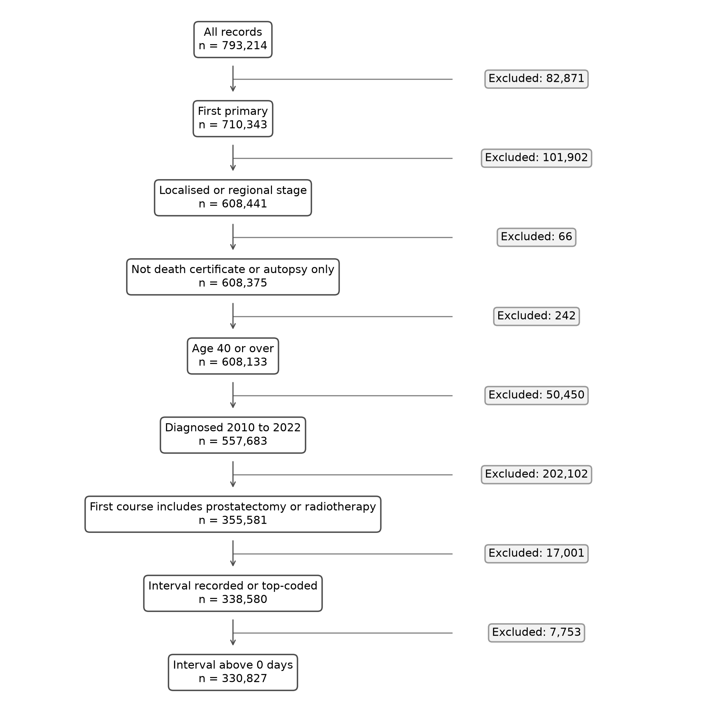
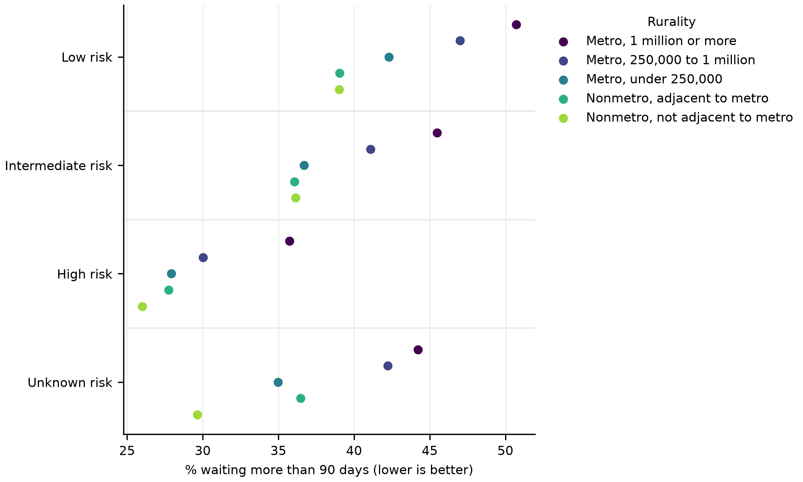
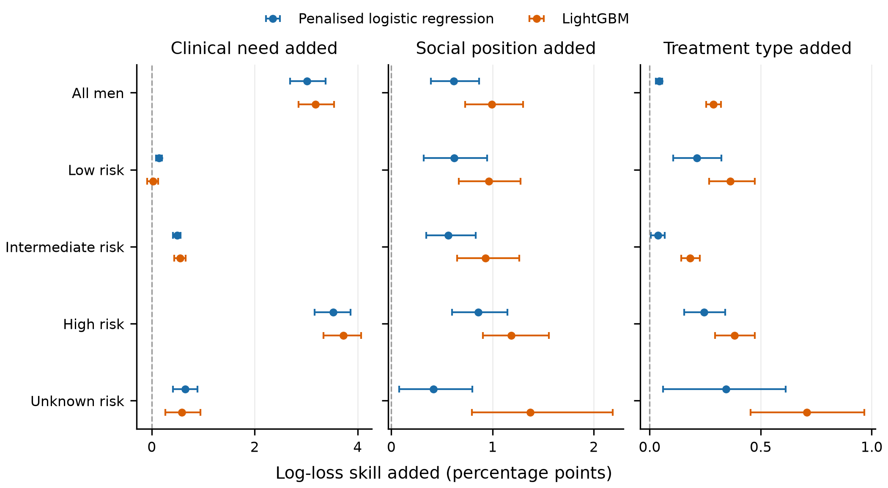
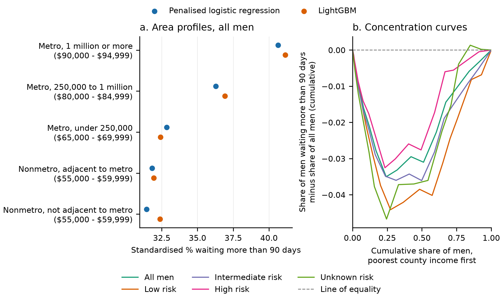

# What area and marital characteristics add to clinical need in predicting waits beyond 90 days for prostate cancer surgery or radiotherapy: a machine learning analysis of US SEER data, 2010 to 2022

**Author:** Tanmay Hinge

**Correspondence:** hingetanmay@gmail.com

**Status:** revised draft for medRxiv (revision 1, after internal review), not peer reviewed.

## Abstract

**Background.** Time from diagnosis to treatment is a common quality measure. US registry studies report multivariable associations between social factors and waiting time; in a PubMed search, we found none that measured how much area and marital characteristics add to predicting delay once recorded clinical need is known.

**Methods.** This retrospective cohort study of the US Surveillance, Epidemiology, and End Results (SEER) 17 registries included men aged 40 or over, diagnosed 2010 to 2022 with localised or regional prostate cancer, with a recorded first course of radical prostatectomy or radiotherapy. The outcome was first recorded treatment more than 90 days after diagnosis, matching the Australian optimal care pathway benchmark. Cross-fitted penalised logistic regression and LightGBM were built in ordered steps (year; clinical need; county rurality, county income and marital status; treatment type) within risk groups. The primary estimand was the out-of-fold log-loss skill added by the area and marital block, with cluster bootstrap intervals.

**Results.** Of 330,827 men, 39.7% waited more than 90 days, rising from 36.0% in 2010 to 52.3% in 2022. Prediction was weak (AUC 0.592 to 0.663; 0.5 is chance). The area and marital block added 0.62 percentage points of log-loss skill (95% interval 0.39 to 0.87) under logistic regression and 0.99 (0.73 to 1.30) under LightGBM, almost unchanged in post-review checks of tuning, fold assignment and clustering. With clinical features held as observed, standardised delay was 9.2 and 8.8 points lower in non-metropolitan counties not adjacent to a metropolitan area than in large metropolitan counties, each at its typical income, and 6.7 and 5.9 points higher for never-married than married men; these contrasts were judged by a post hoc two-model agreement rule, and the intervals planned for them were dropped post hoc. A small gain in individual prediction can therefore coexist with differences of several percentage points between specific area and marital profiles.

**Conclusions.** Among US men with recorded surgery or radiotherapy, recorded clinical, area and marital information predicts little of who waits beyond 90 days, and area and marital characteristics add a small, repeatable increment. Delay was more common in large metropolitan, higher-income counties, but because recorded treatment also differs by area, this is not evidence of better care outside cities.

## Introduction

Time from diagnosis to first treatment is widely used to judge the timeliness of cancer care. In the US National Cancer Database, the median time to first treatment for early-stage breast, prostate, lung, colorectal, renal and pancreatic cancers rose from 21 to 29 days between 2004 and 2013, and care at an academic centre was among the factors associated with longer intervals [1]. For prostate cancer the interval is longer: the median was 79 days (interquartile range 55 to 117) in the same database from 2004 to 2015 [2], and the mean in SEER was 82.75 days in 2021 [3].

Several studies have examined who waits longer, usually with multivariable models. In SEER-Medicare data for 2004 to 2007, time from diagnosis to definitive treatment was longer for African American than for White men with localised prostate cancer in every risk group, with the largest difference in high-risk disease (96 against 105 days), and time to definitive treatment was longer in high-risk than in low-risk disease [4]. Across four cancers in SEER from 2015 to 2020, time to treatment was shorter for lower-income and non-metropolitan patients [5]. In the Tennessee cancer registry, residence in rural Appalachian counties was associated with lower odds of waiting more than 90 days for prostate cancer treatment (odds ratio 0.83, 95% CI 0.78 to 0.89) [6]. Across all cancers in SEER from 2018 to 2021, care at an accredited hospital was associated with a 2.6-day longer median interval in low-income counties but not in high-income counties [7]. Unadjusted comparisons can mislead: in SEER, unadjusted all-cause mortality was lower among patients with longer intervals (26.1% at 0 to 1 month against 11.4% at 10 months or more) [8], a pattern we read as consistent with faster treatment of more aggressive disease.

These studies estimate how single factors are associated with waiting after adjustment. They do not measure how much of the variation in waiting can be predicted from recorded clinical need, or how much area and marital characteristics add beyond it. That added predictive value has been measured for other prostate cancer outcomes: adding neighbourhood variables to a clinical model for advanced prostate cancer changed the AUC from 0.671 to 0.673 in one US health system [9], and a SEER study compared clinical-only and clinical-plus-sociodemographic machine learning models for cancer-specific survival in high-risk disease [10]. In a PubMed search screened by title and abstract by one reviewer, we found no study that applied this incremental approach to time to treatment within prostate cancer risk groups.

Measuring an out-of-sample increment has two advantages here. It describes the size of the area and marital signal without assuming its direction; in two of the studies above, non-metropolitan, rural or lower-income patients had shorter rather than longer intervals [5, 6]. And fitting a flexible model such as gradient boosting [11] alongside penalised regression shows whether an apparent increment reflects an under-fitted clinical model.

We therefore aimed to measure, within clinical risk groups of men treated with radical prostatectomy or radiotherapy, how much county rurality, county income and marital status add to recorded clinical need in predicting a wait of more than 90 days, and to express that contribution as standardised percentages and an income concentration index.

## Methods

### Design, data, protocol and reporting
This was a retrospective cohort study of the SEER Research Data, 17 registries, November 2025 submission, linked to county attributes [12]. A SEER\*Stat case listing was exported with selection by site (prostate) and year of diagnosis (2010 to 2023) only, giving 793,214 tumour records; no age restriction was applied at export. Reporting follows STROBE [13] and RECORD [14], and TRIPOD+AI [15] for the prediction models (Supplementary Tables S45 and S46).

The protocol and all analysis code are public at https://github.com/tanmayhinge/seer-prostate. The protocol version and statistical analysis code for the results reported here are fixed at commit c1b6fd721f9387a2b9df364697bfb3f719c3747c (https://github.com/tanmayhinge/seer-prostate/tree/c1b6fd721f9387a2b9df364697bfb3f719c3747c); later commits change only figure formatting, manuscript files and review records. The protocol (version 1.0) was committed to the project's version history before the cohort was built and before any outcome model was fitted. Thirteen amendments are logged with their reasons (Supplementary Table S43), and the commits that introduced each version are listed in Supplementary Table S44. Commit times are recorded by the author's computer, and the repository was first made public on 13 September 2026, after the analyses were run, so the order of commits can be inspected but is not independently timestamped. Versions 1.1 to 1.3 were committed together with the cohort code, versions 1.5 to 1.7 together with the first Phase 4 results, and version 1.9 together with its robustness analyses and the revised manuscript, so the history cannot show whether those amendments preceded the work committed alongside them. The four unnumbered amendments at the top of the log were already present in version 1.0. The study was not registered. Three amendments were made after seeing results and are labelled as such: the switch to joint area profiles and a two-model agreement rule for standardised contrasts (version 1.7, after a development run), a wider penalty grid (version 1.8) and the post-review robustness analyses (version 1.9).

The study used de-identified data released under the SEER Research Data Use Agreement. No ethics committee approval was sought, and there was no patient or public involvement.

### Cohort
Exclusions were applied in this order (Figure 1): first primary cancer (one primary only, or the first of two or more); localised or regional Combined Summary Stage; not a death certificate or autopsy case, identified from the survival months flag because the type of reporting source was not in the export; aged 40 or over; diagnosed 2010 to 2022, excluding 2023 because of truncated follow-up and new surgery codes; first course including radical prostatectomy or radiotherapy; a recorded or top-coded interval; and an interval above 0 days, because a 0-day interval usually marks a cancer found at a procedure. All eligible men were included, with no sample size calculation. Every label in the export was mapped explicitly to an analysis category, and an unmapped label stopped the analysis.

Radical prostatectomy was surgery code 50, 70 or 80 (A500, A700 or A800 from 2023), checked against the SEER coding manual [16]. Radiotherapy was beam radiation, implants or brachytherapy, combinations, radioisotopes, or radiation not otherwise specified. SEER records the first course of treatment only. The 2023 SEER coding manual instructs that all treatment items are coded as not done when the physician opts for active surveillance, deferred therapy, expectant management or watchful waiting, with any later treatment counted as a second course [16]. Men managed this way are therefore not in the cohort, assuming earlier diagnosis years followed the same rule. Supplementary Table S7 reports the share of intervals above 365 days and the share top-coded, by risk group and rurality.

### Outcome
The outcome used SEER's time from diagnosis to treatment in days, which ends at the first treatment of any kind. Hormone therapy, which is not recorded in this export and is often started before radiotherapy in higher-risk disease, can therefore end the interval before surgery or radiotherapy begins. The primary outcome was a wait of more than 90 days. This threshold has been used in US registry research on prostate cancer treatment delay [6] and matches the Australian optimal care pathway for prostate cancer, which recommends that surgery or radiotherapy begin within 3 months of diagnosis [17]. The SEER interval is not the pathway's own measure. Intervals top-coded at 731 days or more counted as delayed. Thresholds of 60, 120 and 180 days were sensitivity analyses.

### Risk groups
Risk groups combined the clinical Gleason score (SEER variable "Gleason Score Clinical Recode (2010+)"), PSA ("PSA Lab Value Recode (2010+)") and Combined Summary Stage. High risk was regional stage, Gleason score 8 to 10, or PSA above 20 ng/ml; otherwise unknown if Gleason score or PSA was missing; otherwise intermediate for Gleason score 7 or PSA 10 to 20 ng/ml; and otherwise low for Gleason score 6 or lower with PSA below 10 ng/ml. Pathological grade was not used. Summary stage can incorporate pathological findings for men treated surgically, so risk groups and the stage feature are better informed for them than for men treated with radiotherapy.

### Ordered feature steps
Step 0 contained year of diagnosis and a 2020 indicator. Step 1 added clinical need: stage category, clinical Gleason score with a missing indicator, log PSA with top-code and missing indicators, and age band midpoint. Step 2 added the area and marital block: marital status (7 categories including unknown), county Rural-Urban Continuum Code (5 levels plus unknown) and county median household income (16 inflation-adjusted bands entered as an ordinal rank plus an unknown indicator). Two of these three variables describe the county, not the man, and because the export has no registry identifier the block can also carry differences in registry practice. Tables generated before this revision label the block "social position". Step 3 added treatment type (prostatectomy, radiotherapy, or both), entered last because area and marital characteristics can influence the choice of treatment.

### Models and validation
Penalised logistic regression used an L2 penalty, median imputation, standardisation and all pairwise products of the clinical-block features (stage indicators, Gleason score and its missing indicator, log PSA with its top-code and missing indicators, and age midpoint) [18]. LightGBM used a learning rate of 0.05 and handled missing values internally [11]. All performance measures used out-of-fold predictions from 5-fold stratified cross-fitting within each risk group and in all men pooled. Log-loss skill is 1 minus a step's log-loss divided by the log-loss of the step 0 model (0 means no improvement; higher is better). Brier skill, AUC and calibration intercept and slope were also computed. The primary estimand was the skill added from step 1 to step 2. No class-imbalance methods were used, and the models are measurement tools, not models intended for clinical use.

As pre-specified, hyperparameters were tuned once per model and stratum by 3-fold cross-validated log-loss on up to 50,000 men at step 3, and reused at every step (grids: C from 0.01 to 10; 200 or 500 trees; 15 or 63 leaves; a minimum of 50 or 200 men per leaf). Tuning was not nested inside the evaluation folds.

Rurality and income are county measures, and the export has no county or registry identifier. Intervals therefore came from a cluster bootstrap over the cells formed by rurality and income band (500 resamples of out-of-fold predictions, percentile intervals). The bootstrap does not refit or re-tune the models, so these intervals do not include model-fitting variability. Leave-one-variable-out refits removed marital status, rurality or income from step 2 in turn.

**Post-review robustness analyses (version 1.9).** After an internal review, and before running them, we specified: tuning separately at steps 0, 1 and 2; repeating cross-fitting with 10 fold-assignment seeds under that tuning; reporting the number and size of bootstrap cells and repeating the bootstrap with county income band alone as a coarser cluster; refitting without stage in the clinical block; and entering year as categories in logistic regression. Tuning was not repeated per seed and no refitting bootstrap was run, for computing time.

### Standardised percentages
Standardised percentages came from g-computation with a step 2 model fitted to all men in each stratum. Each man kept his own clinical features and year while his area and marital features were set to a profile, and the mean predicted probability was the standardised percentage. The reference profile was married, living in a county in a metropolitan area of 1 million or more, with county income rank at the 83.33% quantile. Because rurality and income are strongly correlated (Table 1), area profiles set both together, at the median income band of men living in each type of area; profiles changing one while holding the other fixed are reported but not interpreted (Supplementary Tables S17 and S18). After a development run showed the two model types disagreeing, we adopted a post hoc rule: a contrast is described as meaningful only when both model types agree on 3 percentage points or more in the same direction. Also post hoc, we dropped the bootstrap intervals the protocol planned for these contrasts, because intervals that hold the fitted model fixed ignore model-fitting variability, so standardised contrasts have no uncertainty intervals.

### Income concentration index
The Erreygers-corrected concentration index [19] of waiting more than 90 days ranked men by county median household income, poorest first, using fractional ranks with tied men sharing the average rank; with 16 income bands, most men are tied. It ranges from -1 to 1, and a positive value means delay is concentrated in higher-income counties. The index is crude within each stratum: it is not standardised for clinical features and does not separate income from rurality. Intervals used the cell bootstrap. As a post-review analysis, the index was also estimated by diagnosis period (2010 to 2014, 2015 to 2019, 2020 to 2022).

### Men without a recorded interval
Among treated men, the percentage delayed was bounded by assuming every man without an interval waited 90 days or less, and then that every such man waited longer. A model for having no recorded interval tested whether this was predicted by area and marital characteristics beyond clinical need, and percentages were reweighted by the inverse of the predicted probability of having an interval. These checks cover only treated men without a recorded interval; they do not address selection into recorded treatment.

### Sensitivity analyses
Ten scenarios each changed one setting: thresholds of 60, 120 and 180 days; risk groups from Gleason score and PSA only (stage remained in the clinical block); prostatectomy without radiotherapy only; excluding 2020; including 2023; including 0-day intervals; one primary cancer only; and excluding prostatectomy not otherwise specified. Steps 0 to 2 were refitted with the primary hyperparameters. The scenarios reuse largely the same men, so agreement across them is not independent replication. A post hoc check re-tuned logistic regression on C from 0.0001 to 10.

### Secondary outcome: recorded curative treatment
Among intermediate- and high-risk men meeting cohort steps 1 to 5, the outcome was a record of radical prostatectomy or radiotherapy in the first course. No record can mean active surveillance, watchful waiting, hormone therapy only, refusal, or treatment the registry did not capture. SEER treatment data are incomplete: among Medicare beneficiaries aged 65 or over diagnosed 2000 to 2006, SEER identified radiation therapy with 80% sensitivity against claims, pooled across several cancer sites and varying by site, stage and patient characteristics, and the authors advised against using SEER data to compare treated and untreated patients [20]. The same ordered steps (0 to 2), models, bootstrap and standardisation were used, with hyperparameters tuned on step 2.

### Disclosure control and software
As the SEER Research Data Use Agreement requires, statistics based on 1 to 4 men are suppressed; counts in cross-tabulations are rounded to the nearest 10, and delayed counts are not shown. Analyses used Python 3.13, pandas 3.0.5, NumPy 2.5.3, scikit-learn 1.9.1, LightGBM 4.7.0, statsmodels 0.15.0 and matplotlib 3.11.2, with seed 20260913. Every table and figure is regenerated by scripts with unit tests; no fitted model is released as a clinical tool.

## Results

### Cohort
Of 793,214 records, 557,683 met the first five steps, 355,581 had radical prostatectomy or radiotherapy in the first course, and 330,827 had a recorded interval above 0 days (Figure 1). Of these men, 48.2% had radical prostatectomy, 47.9% radiotherapy and 3.9% both; 17.4% were low risk, 38.6% intermediate, 39.6% high and 4.5% unknown (Table 1). Rurality and income overlapped heavily: 45.6% of men in non-metropolitan counties not adjacent to a metropolitan area lived in the lowest county income quartile, against 1.1% of men in counties in metropolitan areas of 1 million or more.

### Waiting beyond 90 days
The median wait was 77 days (interquartile range 52 to 116), and 131,326 men (39.7%) waited more than 90 days. A lower percentage means fewer men waited beyond the benchmark, but for low-risk men a longer wait is not necessarily worse care. Delay was more common in low-risk men (47.9%) than in intermediate-risk (42.8%) and high-risk men (32.8%), and it rose from 36.0% in 2010 to 52.3% in 2022 (Figure 2). Waits of more than 365 days were uncommon (3.0% of low-risk and 0.8% of high-risk men), and 0.80% and 0.17% were top-coded (Supplementary Table S7). Within every risk group, delay was more common in large metropolitan counties than in non-metropolitan counties not adjacent to a metropolitan area (50.7% against 39.0% in low-risk and 35.7% against 26.0% in high-risk men), more common in the highest than the lowest county income quartile (high risk: 33.4% against 26.7%), and more common among never-married than married men (high risk: 40.0% against 30.9%).

In the scenario limited to prostatectomy without radiotherapy, in which hormone therapy is less likely to end the interval, delay was 45.8% in low-risk and 38.4% in high-risk men, against 47.9% and 32.8% in the primary cohort (Supplementary Table S29).

### How much area and marital characteristics add
Prediction was weak (Table 2). At step 2, AUC ranged from 0.592 to 0.663 across strata and models, and log-loss skill over year alone from 0.76% to 4.90%. Clinical need added 3.01 percentage points of skill in all men under logistic regression (95% interval 2.69 to 3.38) and 3.53 in high-risk men, but only 0.14 (0.08 to 0.20) in low-risk men, whose clinical variables vary little by definition. In the prostatectomy-only scenario, clinical need added 1.66 points in all men under both models and 2.20 and 2.13 in high-risk men (Supplementary Table S35).

The area and marital block added 0.62 points (0.39 to 0.87) under logistic regression and 0.99 (0.73 to 1.30) under LightGBM in all men, and 0.86 (0.60 to 1.15) and 1.18 (0.90 to 1.56) in high-risk men (Figure 3). Every interval lay above 0. In low-risk men it added 0.62 (0.32 to 0.94) and 0.96 (0.67 to 1.28), which was 82% and 98% of a small step 2 skill (0.76 and 0.99 points). Treatment type, added afterwards, contributed 0.04 to 0.71 points. Removing marital status or rurality from step 2 each lost 0.18 to 0.45 points in the pooled, intermediate- and high-risk strata. The two models disagreed on how much income carried on its own: 0.00 to 0.02 points under logistic regression, and 0.26 to 0.29 under LightGBM.

LightGBM had higher step 2 skill than penalised logistic regression in every stratum, by 0.23 to 0.90 points; no interval was computed for these differences. Calibration slopes at step 2 were 0.98 to 1.00 for logistic regression and 0.88 to 1.03 for LightGBM, where 1 is ideal (Supplementary Figure S1). Logistic regression chose C = 0.01, the edge of the pre-specified grid, in every stratum; re-tuning on a wider grid chose the same value, with identical results.

**Post-review robustness analyses.** Tuning separately at each step left the increments essentially unchanged: in all men, 0.62 (0.39 to 0.87) under logistic regression and 0.99 (0.73 to 1.30) under LightGBM with the first fold assignment, and 0.61 to 0.62 and 0.98 to 0.99 across 10 fold assignments. Under per-step tuning, logistic regression chose C at the edge of the grid (0.01) in 8 of 15 stratum and step combinations; the wider grid was checked only for the primary tuning. In every stratum and model, the smallest increment across fold assignments was above 0, and the interval lay above 0 both with the rurality by income cells and with county income band alone as clusters. In all men the bootstrap used 79 cells; the smallest held 23 men and the largest 8.5% of men. The LightGBM clinical model was at least as good as the logistic one in all men and in intermediate- and high-risk men, but not in low-risk (0.05 against 0.14 points) or unknown-risk men (0.55 against 0.64). Removing stage from the clinical block gave increments of 0.62 and 1.02 (0.75 to 1.33) in all men, and entering year as categories in logistic regression gave 0.62 (0.39 to 0.86) (Supplementary Tables S11 to S15).

### Standardised percentages and excess days
Standardised delay was lower in non-metropolitan counties not adjacent to a metropolitan area than in large metropolitan counties, each at its typical county income ($55,000 to $59,999 against $90,000 to $94,999): by 9.2 points under logistic regression and 8.8 under LightGBM in all men (Figure 4a, Table 3), and by 7.2 to 14.2 points across risk groups, with both models agreeing on 3 points or more. This contrast moves rurality and income together. Changing rurality alone gave -8.7 and +1.7 points, and changing income alone gave -0.9 and -8.7 points, under the two models, so the separate contributions of rurality and income cannot be identified (Supplementary Table S17). Never-married men had standardised delay 6.7 and 5.9 points higher than married men; the models agreed in every stratum except low risk (3.6 and 2.4). Setting every man's area and marital features to the reference profile raised the pooled percentage by 1.1 and 1.6 points. Crude excess waiting beyond 90 days averaged 30.6 days per man in large metropolitan counties and 20.0 days in non-metropolitan counties not adjacent to a metropolitan area (30,597 and 20,014 days per 1,000 men). These are crude: the protocol's 7-day threshold for a meaningful difference applied to standardised waiting days, which were not modelled (amendment 1.6). Intervals top-coded at 731 days or more contributed 6.8% to 10.9% of crude excess days across known rurality groups (Supplementary Table S19a).

### Income concentration
Crude delay was concentrated among men in higher-income counties (Figure 4b): the Erreygers index was 0.062 (0.039 to 0.083) in all men, 0.103 (0.068 to 0.134) in low-risk, 0.075 (0.051 to 0.096) in intermediate-risk and 0.041 (0.017 to 0.065) in high-risk men. Because higher-income counties are mostly metropolitan, this gradient cannot be separated from rurality. Within diagnosis periods the index was smaller in all men: 0.059 (0.025 to 0.092) in 2010 to 2014, 0.037 (0.011 to 0.065) in 2015 to 2019 and 0.027 (0.003 to 0.061) in 2020 to 2022, and every high-risk interval included 0. Over the same periods the share of men in the highest county income quartile rose from 26.2% to 41.0% while delay also rose, consistent with part of the pooled index reflecting change over time (Supplementary Tables S21 and S22).

### Men without a recorded interval
Between 2.7% and 5.5% of treated men had no recorded interval, depending on rurality. The rurality gap held under the extreme bounds: 40.2% to 45.7% for large metropolitan counties against 31.3% to 34.0% for non-metropolitan counties not adjacent to a metropolitan area. Having no recorded interval was predicted by area and marital characteristics beyond clinical need (0.53 points of skill, 0.07 to 1.02). Inverse probability weighting changed published group percentages by at most 0.36 points, and by at most 0.21 points in groups of 1,000 men or more.

### Sensitivity analyses
Across the ten scenarios, the 95% interval for the area and marital increment lay above 0 in 98 of 100 scenario, stratum and model combinations; both exceptions were in the unknown-risk stratum, and one further lower bound was 0.00 (Supplementary Figure S2). In all men, the increment ranged from 0.54 to 0.68 points under logistic regression and 0.94 to 1.06 under LightGBM. LightGBM had higher step 2 skill in 47 of 50 combinations, and the three exceptions differed by 0.17 points or less; no interval was computed for these differences. Both models agreed on a lower standardised delay of 3 points or more in non-metropolitan counties not adjacent to a metropolitan area in 9 of 10 scenarios; at the 180-day threshold the contrasts were -2.96 and -3.20. The marital contrast met the rule in all 10 scenarios.

### Secondary outcome: recorded curative treatment
Of 352,644 intermediate- and high-risk men, 75.4% of intermediate-risk and 81.1% of high-risk men had a recorded radical prostatectomy or radiotherapy. Among high-risk men, 81.9% in large metropolitan counties and 75.3% in non-metropolitan counties not adjacent to a metropolitan area had one. Prediction was stronger than for delay (AUC at step 2 from 0.692 to 0.865). The area and marital block added 1.96 points of skill (1.72 to 2.31) under logistic regression and 2.16 (1.92 to 2.54) under LightGBM, with every interval above 0. Never-married men were 6.5 and 5.9 points less likely than married men to have a recorded curative treatment. The standardised area contrast was -2.9 and -1.4 points in intermediate- and high-risk men pooled; in high-risk men it was -3.3 and -2.5, with only one model reaching 3 points. Logistic regression chose C at an edge of the grid for intermediate-risk (0.01) and high-risk men (10).

## Discussion

### Principal findings
In 330,827 US men with recorded radical prostatectomy or radiotherapy, whether a man waited more than 90 days was only weakly predictable from recorded clinical, area and marital information. Clinical need predicted delay mainly in high-risk men. County rurality, county income and marital status added a small increment of 0.42 to 1.37 points of log-loss skill across strata and models; it was above 0 in every stratum under the primary analysis and in almost all sensitivity analyses, and it was essentially unchanged by per-step tuning, repeated fold assignment and coarser clustering, although none of these checks refits the models within bootstrap resamples. Delay was more common in large metropolitan, higher-income counties than in non-metropolitan, lower-income counties, and more common among never-married men. The rise in delay from 36.0% in 2010 to 52.3% in 2022 is in the same direction as national evidence that intervals for several cancers lengthened between 2004 and 2013 [1]; this study did not examine its causes.

### Interpreting the size of the increment
A skill increment below 1.4 points means that adding area and marital characteristics improves the average accuracy of individual predictions only slightly, because most of the variation in waiting is not captured by registry variables. The same block is nonetheless associated with standardised differences of 6 to 9 percentage points between specific area or marital profiles. The two statements are compatible: few men are in the most different profiles, and for the cohort as a whole the observed profile differed from the reference by only 1.1 to 1.6 points. In low-risk men, the block made up most of the step 2 skill, but that skill was only 0.76 and 0.99 points, and clinical variables vary little within a group defined by them.

### What the direction can and cannot show
A wait beyond 90 days can reflect considered deferral, patient choice, time to decide between surgery and radiotherapy, hormone therapy started first, or access problems, and registry data cannot separate these. The lower delay in high-risk men is consistent with triage, but it is also consistent with hormone therapy ending the interval before radiotherapy: when radiotherapy patients were excluded, high-risk delay rose from 32.8% to 38.4% and the clinical need increment roughly halved in all men, although it remained 2.13 to 2.20 points in high-risk men.

The area direction applies to the joint contrast only. Because rurality and income move together, and one-at-a-time profiles gave conflicting results, the data do not show whether rurality or income drives it. It agrees with US studies that found shorter intervals for non-metropolitan or rural patients [5, 6] and with national evidence that care at academic centres is associated with longer intervals [1], although this export does not record where men were treated. It is not evidence that rural men receive better care. The cohort is restricted to men with recorded curative treatment, and recorded treatment was itself less common in non-metropolitan counties among high-risk men (75.3% against 81.9%), consistent with a national SEER study of guideline-concordant management [21]. If men in rural counties who would have waited longer are more often managed without recorded curative treatment, or have treatment the registry does not capture [20], the direction would be exaggerated; the bounds for missing intervals do not address this. In an earlier SEER study, urban men with low-risk disease had lower odds of surveillance or watchful waiting than rural men [22], which would remove rural men from this cohort, although the effect of that on waiting times is unknown.

Never-married men were both more often delayed and less often recorded as having curative treatment. Unmarried men with favourable-risk disease were more likely to be managed with surveillance or watchful waiting in the same earlier study [22], but that study covered favourable-risk disease and does not explain the pattern in intermediate- and high-risk men. Without data on social support, comorbidity or insurance, the reason cannot be identified; in SEER-Medicare, comorbidity and other patient health measures explained only part of a racial gap in definitive treatment [23].

### The machine learning comparison
Gradient boosting improved on penalised regression by less than 1 point of skill in every stratum, and the area and marital increment was larger under gradient boosting. The wider penalty grid ruled out the original grid edge as an explanation. Tuning at each step did not change this. In low-risk and unknown-risk men, however, the LightGBM clinical model was weaker than the logistic one even with its own tuning, so the larger LightGBM increment in those strata may partly reflect a weaker clinical reference. The inference that flexible clinical adjustment did not absorb the area and marital signal therefore rests on all men and on intermediate- and high-risk men.

### Australian context
No Australian data were analysed, and the US results cannot be compared directly with Australian findings: area measures, health systems and interval definitions differ. The 90-day threshold matches the Australian optimal care pathway for prostate cancer [17]. In Tasmania, men from outer regional and remote areas took a median of 82 days to start active treatment, against 75 days for men from inner regional areas, an age-adjusted mean difference of 9.25 days (95% CI 1.72 to 16.79) [24]. Among Tasmanian men not treated with external beam radiotherapy, those treated in public facilities started treatment 42 to 59 days later than those treated privately, after adjustment [25]. In Queensland, the median treatment interval was 65 days (interquartile range 36 to 107), and men without private health insurance or treated with radiotherapy alone were more likely to wait more than 70 days [26]. In Tasmanian lung cancer care, benchmarking against pathway standards found that on average 7% of patients met the treatment-time standards [27], and general practitioners described fragmented referral and limited rural specialist access as barriers [28]. The approach used here, a benchmark-based outcome with risk-stratified out-of-sample increments, joint area profiles and explicit handling of missing intervals, could be applied to an Australian registry that records remoteness, area socioeconomic indices and treating sector, where referral and multidisciplinary meeting dates would allow the interval to be divided into parts a health service can act on. Comparing survival between treated and untreated men would need a design that avoids immortal time bias [29] (Supplementary Box 1).

### Strengths and limitations
The strengths are a large population-based cohort, a protocol committed before modelling with all amendments logged, out-of-sample estimation with two model types, a cluster bootstrap over rurality by income cells as a proxy for county-level dependence, bounds for missing intervals, ten sensitivity analyses and post-review robustness checks, and public code that regenerates every table and figure.

The limitations are substantial. The export had no race or ethnicity, insurance, registry identifier or comorbidity, so part of the area and marital increment may reflect unmeasured health, insurance or registry practice. Two of the three variables are county measures. The interval ends at the first treatment of any kind, and the SEER diagnosis date may not be recorded consistently across registries, years, or metropolitan and rural settings; if recording differs by setting or over time, both the area contrast and the 2010 to 2022 trend could be biased. SEER under-captures treatment given outside reporting facilities [20]. Summary stage partly uses pathology for surgical patients. The cohort is conditioned on recorded curative treatment. The primary intervals do not include model-fitting variability, tuning was not nested, and standardised contrasts have no intervals. Logistic regression often chose the smallest penalty value on its grid; a wider grid was checked only for the primary delay models, not for per-step tuning or the secondary outcome. Three amendments were made after seeing results. The sensitivity analyses reuse largely the same men. All results are associations, not causal effects. The analysis was done by one person with AI assistance, and the internal review was simulated by AI reviewers rather than by a clinician or biostatistician.

### Conclusions
In US registry data, whether a man with recorded prostatectomy or radiotherapy waits beyond 90 days is mostly not predictable from recorded information. County rurality, county income and marital status add a small, repeatable increment beyond recorded clinical need, and delay was more common in large metropolitan, higher-income counties among men with recorded curative treatment. Because recorded treatment also varies by area, and hormone therapy can end the interval, these patterns describe who waits among treated men rather than who receives better care. Measuring the same increment in a registry with referral dates, treating sector and comorbidity would show what the signal represents.

## Declarations

- **Funding:** none.
- **Competing interests:** none.
- **Ethics:** de-identified data released under the SEER Research Data Use Agreement; no ethics committee approval was sought.
- **Patient and public involvement:** none.
- **Data availability:** SEER data are available from the National Cancer Institute under a Research Data Use Agreement and cannot be shared by the author. Aggregate results tables are in the code repository.
- **Code and protocol availability:** https://github.com/tanmayhinge/seer-prostate (protocol, amendment log, analysis code, tests and aggregate results); the analyses reported here are fixed at commit c1b6fd721f9387a2b9df364697bfb3f719c3747c.
- **Use of AI tools:** code, analyses and manuscript text were developed with assistance from Claude (Anthropic), and an internal pre-submission review was simulated with AI reviewer agents. The author is responsible for the study design, checks and interpretation.

## Tables

### Table 1. Characteristics of the primary cohort by county rurality
Cells are n (% of the column's men), except days, which are median (interquartile range). County income quartiles group the 16 bands of county median household income: Q1 under $55,000, Q2 $55,000 to $74,999, Q3 $75,000 to $94,999 and Q4 $95,000 or more; these are groups of four consecutive bands, not quartiles of men. Counts of 1 to 4 are shown as <5, and a second cell is hidden wherever a row or column total would reveal them.

| characteristic | level | Overall | Metro, 1 million or more | Metro, 250,000 to 1 million | Metro, under 250,000 | Nonmetro, adjacent to metro | Nonmetro, not adjacent to metro | Unknown |
|---|---|---|---|---|---|---|---|---|
| Men, n |  | 330,827 | 194,681 | 72,150 | 26,092 | 23,360 | 14,385 | 159 |
| Age at diagnosis | 40-44 years | 1,480 (0.4%) | 928 (0.5%) | 319 (0.4%) | 111 (0.4%) | 71 (0.3%) | 51 (0.4%) | 0 (0.0%) |
| Age at diagnosis | 45-49 years | 6,921 (2.1%) | 4,386 (2.3%) | 1,439 (2.0%) | 501 (1.9%) | 387 (1.7%) | 203 (1.4%) | 5 (3.1%) |
| Age at diagnosis | 50-54 years | 24,293 (7.3%) | 14,862 (7.6%) | 5,198 (7.2%) | 1,820 (7.0%) | 1,503 (6.4%) | 899 (6.2%) | 11 (6.9%) |
| Age at diagnosis | 55-59 years | 49,078 (14.8%) | 29,373 (15.1%) | 10,741 (14.9%) | 3,658 (14.0%) | 3,232 (13.8%) | 2,044 (14.2%) | 30 (18.9%) |
| Age at diagnosis | 60-64 years | 70,459 (21.3%) | 41,419 (21.3%) | 15,405 (21.4%) | 5,585 (21.4%) | 4,942 (21.2%) | 3,070 (21.3%) | 38 (23.9%) |
| Age at diagnosis | 65-69 years | 83,831 (25.3%) | 48,697 (25.0%) | 18,343 (25.4%) | 6,726 (25.8%) | 6,248 (26.7%) | 3,785 (26.3%) | 32 (20.1%) |
| Age at diagnosis | 70-74 years | 56,371 (17.0%) | 32,308 (16.6%) | 12,399 (17.2%) | 4,645 (17.8%) | 4,410 (18.9%) | 2,577 (17.9%) | 32 (20.1%) |
| Age at diagnosis | 75-79 years | 28,114 (8.5%) | 16,536 (8.5%) | 6,059 (8.4%) | 2,249 (8.6%) | 1,950 (8.3%) | 1,311 (9.1%) | 9 (5.7%) |
| Age at diagnosis | 80-84 years | 8,636 (2.6%) | 5,148 (2.6%) | 1,885 (2.6%) | 681 (2.6%) | 530 (2.3%) | <5 | <5 |
| Age at diagnosis | 85-89 years | 1,516 (0.5%) | 940 (0.5%) | 337 (0.5%) | 109 (0.4%) | 80 (0.3%) | <5 | <5 |
| Age at diagnosis | 90+ years | 128 (0.0%) | 84 (0.0%) | 25 (0.0%) | 7 (0.0%) | 7 (0.0%) | 5 (0.0%) | 0 (0.0%) |
| Year of diagnosis | 2010 to 2014 | 126,503 (38.2%) | 74,127 (38.1%) | 27,219 (37.7%) | 10,445 (40.0%) | 8,850 (37.9%) | 5,793 (40.3%) | 69 (43.4%) |
| Year of diagnosis | 2015 to 2019 | 122,936 (37.2%) | 72,147 (37.1%) | 26,945 (37.3%) | 9,621 (36.9%) | 8,749 (37.5%) | 5,431 (37.8%) | 43 (27.0%) |
| Year of diagnosis | 2020 to 2022 | 81,388 (24.6%) | 48,407 (24.9%) | 17,986 (24.9%) | 6,026 (23.1%) | 5,761 (24.7%) | 3,161 (22.0%) | 47 (29.6%) |
| Marital status | Married (including common law) | 232,525 (70.3%) | 135,592 (69.6%) | 51,698 (71.7%) | 18,144 (69.5%) | 16,696 (71.5%) | 10,308 (71.7%) | 87 (54.7%) |
| Marital status | Single (never married) | 36,703 (11.1%) | 22,527 (11.6%) | 7,799 (10.8%) | 2,727 (10.5%) | 2,361 (10.1%) | <5 | <5 |
| Marital status | Divorced | 22,023 (6.7%) | 12,267 (6.3%) | 4,912 (6.8%) | 1,931 (7.4%) | 1,772 (7.6%) | 1,129 (7.8%) | 12 (7.5%) |
| Marital status | Separated | 2,630 (0.8%) | 1,656 (0.9%) | 530 (0.7%) | 200 (0.8%) | <5 | <5 | <5 |
| Marital status | Widowed | 9,905 (3.0%) | 5,319 (2.7%) | 2,244 (3.1%) | 926 (3.5%) | 866 (3.7%) | 543 (3.8%) | 7 (4.4%) |
| Marital status | Unmarried or Domestic Partner | 1,369 (0.4%) | 820 (0.4%) | 329 (0.5%) | 91 (0.3%) | <5 | <5 | 0 (0.0%) |
| Marital status | Unknown | 25,672 (7.8%) | 16,500 (8.5%) | 4,638 (6.4%) | 2,073 (7.9%) | 1,437 (6.2%) | 978 (6.8%) | 46 (28.9%) |
| County median household income (quartile of 16 bands) | Q1 (lowest) | 26,436 (8.0%) | 2,200 (1.1%) | 3,596 (5.0%) | 5,276 (20.2%) | 8,804 (37.7%) | 6,560 (45.6%) | 0 (0.0%) |
| County median household income (quartile of 16 bands) | Q2 | 79,804 (24.1%) | 24,179 (12.4%) | 23,461 (32.5%) | 15,247 (58.4%) | 10,533 (45.1%) | 6,384 (44.4%) | 0 (0.0%) |
| County median household income (quartile of 16 bands) | Q3 | 116,211 (35.1%) | 83,131 (42.7%) | 24,466 (33.9%) | 4,703 (18.0%) | 2,571 (11.0%) | 1,276 (8.9%) | 64 (40.3%) |
| County median household income (quartile of 16 bands) | Q4 (highest) | 108,348 (32.8%) | 85,171 (43.7%) | 20,627 (28.6%) | 866 (3.3%) | 1,452 (6.2%) | 165 (1.1%) | 67 (42.1%) |
| County median household income (quartile of 16 bands) | Unknown | 28 (0.0%) | 0 (0.0%) | 0 (0.0%) | 0 (0.0%) | 0 (0.0%) | 0 (0.0%) | 28 (17.6%) |
| Risk group | low | 57,495 (17.4%) | 34,262 (17.6%) | 11,928 (16.5%) | 4,779 (18.3%) | 3,991 (17.1%) | 2,512 (17.5%) | 23 (14.5%) |
| Risk group | intermediate | 127,622 (38.6%) | 75,192 (38.6%) | 28,135 (39.0%) | 10,065 (38.6%) | 8,834 (37.8%) | 5,356 (37.2%) | 40 (25.2%) |
| Risk group | high | 130,893 (39.6%) | 75,764 (38.9%) | 29,317 (40.6%) | 10,127 (38.8%) | 9,586 (41.0%) | 6,011 (41.8%) | 88 (55.3%) |
| Risk group | unknown | 14,817 (4.5%) | 9,463 (4.9%) | 2,770 (3.8%) | 1,121 (4.3%) | 949 (4.1%) | 506 (3.5%) | 8 (5.0%) |
| Summary stage | Localised | 256,475 (77.5%) | 151,179 (77.7%) | 55,346 (76.7%) | 20,532 (78.7%) | 18,088 (77.4%) | 11,209 (77.9%) | 121 (76.1%) |
| Summary stage | Regional, direct extension | 61,984 (18.7%) | 35,854 (18.4%) | 14,124 (19.6%) | 4,757 (18.2%) | 4,513 (19.3%) | 2,707 (18.8%) | 29 (18.2%) |
| Summary stage | Regional, lymph nodes | 12,368 (3.7%) | 7,648 (3.9%) | 2,680 (3.7%) | 803 (3.1%) | 759 (3.2%) | 469 (3.3%) | 9 (5.7%) |
| Clinical Gleason score | 6 or less | 81,630 (24.7%) | 48,408 (24.9%) | 16,883 (23.4%) | 6,819 (26.1%) | 5,789 (24.8%) | 3,684 (25.6%) | 47 (29.6%) |
| Clinical Gleason score | 7 | 171,345 (51.8%) | 101,245 (52.0%) | 37,799 (52.4%) | 13,217 (50.7%) | 11,897 (50.9%) | 7,121 (49.5%) | 66 (41.5%) |
| Clinical Gleason score | 8 to 10 | 73,447 (22.2%) | 42,202 (21.7%) | 16,666 (23.1%) | 5,755 (22.1%) | 5,368 (23.0%) | <5 | <5 |
| Clinical Gleason score | Unknown | 4,405 (1.3%) | 2,826 (1.5%) | 802 (1.1%) | 301 (1.2%) | 306 (1.3%) | <5 | <5 |
| PSA (ng/ml) | below 10 | 223,700 (67.6%) | 132,150 (67.9%) | 49,185 (68.2%) | 17,686 (67.8%) | 15,427 (66.0%) | 9,198 (63.9%) | 54 (34.0%) |
| PSA (ng/ml) | 10 to 20 | 58,930 (17.8%) | 33,727 (17.3%) | 13,098 (18.2%) | 4,619 (17.7%) | 4,437 (19.0%) | 3,005 (20.9%) | 44 (27.7%) |
| PSA (ng/ml) | above 20 | 28,789 (8.7%) | 16,581 (8.5%) | 6,163 (8.5%) | 2,290 (8.8%) | 2,162 (9.3%) | 1,545 (10.7%) | 48 (30.2%) |
| PSA (ng/ml) | Unknown | 19,408 (5.9%) | 12,223 (6.3%) | 3,704 (5.1%) | 1,497 (5.7%) | 1,334 (5.7%) | 637 (4.4%) | 13 (8.2%) |
| First-course treatment | Radical prostatectomy | 159,580 (48.2%) | 94,117 (48.3%) | 35,254 (48.9%) | 12,782 (49.0%) | 10,677 (45.7%) | 6,675 (46.4%) | 75 (47.2%) |
| First-course treatment | Radiotherapy | 158,473 (47.9%) | 93,163 (47.9%) | 33,841 (46.9%) | 12,308 (47.2%) | 11,873 (50.8%) | 7,210 (50.1%) | 78 (49.1%) |
| First-course treatment | Both | 12,774 (3.9%) | 7,401 (3.8%) | 3,055 (4.2%) | 1,002 (3.8%) | 810 (3.5%) | 500 (3.5%) | 6 (3.8%) |
| Days to first recorded treatment | median (IQR) | 77.0 (52.0 to 116.0) | 81.0 (55.0 to 121.0) | 76.0 (50.0 to 112.0) | 71.0 (48.0 to 106.0) | 70.0 (46.0 to 105.0) | 68.0 (43.0 to 103.0) | 64.0 (40.0 to 103.5) |
| Waited more than 90 days | 90 days or less | 199,501 (60.3%) | 111,852 (57.5%) | 45,016 (62.4%) | 17,160 (65.8%) | 15,610 (66.8%) | 9,757 (67.8%) | 106 (66.7%) |
| Waited more than 90 days | over 90 days | 131,326 (39.7%) | 82,829 (42.5%) | 27,134 (37.6%) | 8,932 (34.2%) | 7,750 (33.2%) | 4,628 (32.2%) | 53 (33.3%) |

### Table 2. Out-of-fold skill added at each step, by risk group and model
Skill is the percentage reduction in out-of-fold log-loss against the step 0 model (higher is better). Added values are percentage points with 95% cluster bootstrap intervals that do not include model-fitting variability. "Social position" is the area and marital block.

| stratum | model | men | skill at step 2 | clinical need added | social position added | social position as % of step 2 skill | treatment type added |
|---|---|---|---|---|---|---|---|
| all men (pooled) | penalised logistic regression | 330,827 | 3.63 | 3.01 (2.69 to 3.38) | 0.62 (0.39 to 0.87) | 17 | 0.04 (0.03 to 0.06) |
| all men (pooled) | LightGBM | 330,827 | 4.17 | 3.18 (2.85 to 3.54) | 0.99 (0.73 to 1.30) | 24 | 0.29 (0.25 to 0.32) |
| low risk | penalised logistic regression | 57,495 | 0.76 | 0.14 (0.08 to 0.20) | 0.62 (0.32 to 0.94) | 82 | 0.21 (0.11 to 0.32) |
| low risk | LightGBM | 57,495 | 0.99 | 0.02 (-0.09 to 0.13) | 0.96 (0.67 to 1.28) | 98 | 0.36 (0.27 to 0.47) |
| intermediate risk | penalised logistic regression | 127,622 | 1.06 | 0.49 (0.41 to 0.56) | 0.56 (0.35 to 0.83) | 53 | 0.04 (0.01 to 0.07) |
| intermediate risk | LightGBM | 127,622 | 1.48 | 0.55 (0.44 to 0.65) | 0.93 (0.65 to 1.27) | 63 | 0.18 (0.14 to 0.23) |
| high risk | penalised logistic regression | 130,893 | 4.39 | 3.53 (3.16 to 3.86) | 0.86 (0.60 to 1.15) | 20 | 0.24 (0.15 to 0.34) |
| high risk | LightGBM | 130,893 | 4.90 | 3.72 (3.34 to 4.06) | 1.18 (0.90 to 1.56) | 24 | 0.38 (0.30 to 0.47) |
| unknown risk | penalised logistic regression | 14,817 | 1.07 | 0.65 (0.41 to 0.89) | 0.42 (0.08 to 0.80) | 39 | 0.34 (0.06 to 0.61) |
| unknown risk | LightGBM | 14,817 | 1.96 | 0.59 (0.27 to 0.95) | 1.37 (0.80 to 2.19) | 70 | 0.71 (0.45 to 0.97) |

### Table 3. Standardised differences in the percentage waiting more than 90 days
Percentage points, without uncertainty intervals. A contrast is described as meaningful only when both model types agree on 3 points or more in the same direction (a rule adopted after a development run). The area contrast moves rurality and county income together.

| stratum | contrast | penalised logistic regression | LightGBM | agreement |
|---|---|---|---|---|
| all men (pooled) | all social features as observed minus reference profile | -1.1 | -1.6 | both models under 3 points |
| all men (pooled) | area: Nonmetro, not adjacent to metro minus Metro, 1 million or more, each at its typical county income | -9.2 | -8.8 | both models 3 points or more, same direction |
| all men (pooled) | marital status: Single (never married) minus Married (including common law) | 6.7 | 5.9 | both models 3 points or more, same direction |
| low risk | all social features as observed minus reference profile | -3.4 | -4.7 | both models 3 points or more, same direction |
| low risk | area: Nonmetro, not adjacent to metro minus Metro, 1 million or more, each at its typical county income | -11.3 | -13.5 | both models 3 points or more, same direction |
| low risk | marital status: Single (never married) minus Married (including common law) | 3.6 | 2.4 | same direction, only one model 3 points or more |
| intermediate risk | all social features as observed minus reference profile | -1.4 | -1.6 | both models under 3 points |
| intermediate risk | area: Nonmetro, not adjacent to metro minus Metro, 1 million or more, each at its typical county income | -8.7 | -9.5 | both models 3 points or more, same direction |
| intermediate risk | marital status: Single (never married) minus Married (including common law) | 6.4 | 5.5 | both models 3 points or more, same direction |
| high risk | all social features as observed minus reference profile | 0.1 | -0.1 | both models under 3 points |
| high risk | area: Nonmetro, not adjacent to metro minus Metro, 1 million or more, each at its typical county income | -8.4 | -7.2 | both models 3 points or more, same direction |
| high risk | marital status: Single (never married) minus Married (including common law) | 8.3 | 7.6 | both models 3 points or more, same direction |
| unknown risk | all social features as observed minus reference profile | -0.1 | 0.0 | both models under 3 points |
| unknown risk | area: Nonmetro, not adjacent to metro minus Metro, 1 million or more, each at its typical county income | -12.1 | -14.2 | both models 3 points or more, same direction |
| unknown risk | marital status: Single (never married) minus Married (including common law) | 6.0 | 6.2 | both models 3 points or more, same direction |

## Figures

**Figure 1. Inclusion flow for the primary cohort.** Boxes give the number of records remaining after each step, in protocol order; side boxes give the number excluded at that step.

**Figure 2. Crude percentage of men waiting more than 90 days** from diagnosis to first recorded treatment, by risk group and county rurality. Men with unknown rurality, and percentages resting on 1 to 4 men, are not shown. Nothing is adjusted.

**Figure 3. Out-of-fold log-loss skill added by each block of features,** in percentage points, by risk group and model type, with 95% cluster bootstrap intervals (500 resamples, no refitting). "Social position added" is the area and marital block. The dashed line marks no added skill, and the x-axis scale differs between panels.

**Figure 4. (a)** Standardised percentage of all men waiting more than 90 days, with rurality and county income set together to each type of area at the median income band of men living there. Each man keeps his own clinical features and year, and marital status is set to married; the x-axis does not start at 0. **(b)** Crude concentration curves of waiting more than 90 days by county income rank, by risk group, shown as the difference from the line of equality (cumulative share of delayed men minus cumulative share of men). Values below 0 mean delay is concentrated among men in higher-income counties; the curves do not separate income from rurality.

## References

1. Khorana AA, Tullio K, Elson P, et al. Time to initial cancer treatment in the United States and association with survival over time: an observational study. PLoS One. 2019;14(3):e0213209. doi:10.1371/journal.pone.0213209
2. Cone EB, Marchese M, Paciotti M, et al. Assessment of time-to-treatment initiation and survival in a cohort of patients with common cancers. JAMA Netw Open. 2020;3(12):e2030072. doi:10.1001/jamanetworkopen.2020.30072
3. Abdel-Rahman O, Ghosh S. Disparities in time to treatment initiation among patients with major types of cancer in the United States. J Racial Ethn Health Disparities. 2026. doi:10.1007/s40615-026-02847-w
4. Stokes WA, Hendrix LH, Royce TJ, et al. Racial differences in time from prostate cancer diagnosis to treatment initiation: a population-based study. Cancer. 2013;119(13):2486-2493. doi:10.1002/cncr.27975
5. Di Vanna M, Shambhavi S, Khikmatov M, et al. Time to treatment initiation of lung, breast, colorectal, and prostate cancers and contributing factors from 2015 to 2020 utilizing Surveillance, Epidemiology, and End Results Program database. World J Oncol. 2025;16(2):152-160. doi:10.14740/wjon2519
6. Montiel Ishino FA, Odame EA, Villalobos K, et al. Sociodemographic and geographic disparities of prostate cancer treatment delay in Tennessee: a population-based study. Am J Mens Health. 2021;15(6):15579883211057990. doi:10.1177/15579883211057990
7. Semprini JT, Devine JW, Lizarraga IM, et al. Hospital accreditation and geographic disparities in timely cancer care. Health Serv Res. 2026;61(2):e14655. doi:10.1111/1475-6773.14655
8. Ang SP, Lee E, Chia JE, et al. Time-to-treatment initiation and its effect on all-cause mortality: insights from the Surveillance, Epidemiology, and End Results database. World J Oncol. 2025;16(3):286-294. doi:10.14740/wjon2584
9. Tagai EK, Handorf EA, Sorice KA, et al. Does inclusion of neighborhood variables improve clinical risk prediction for advanced prostate cancer in Black and White men? Urol Oncol. 2025;43(5):334.e17-334.e24. doi:10.1016/j.urolonc.2025.02.021
10. Ajjawi I, Kim IE Jr, Smani S, et al. Machine learning approaches to optimize the integration of sociodemographic factors for predicting cancer-specific survival among patients with high-risk prostate cancer. Curr Urol. 2026;20(3):141-147. doi:10.1097/CU9.0000000000000335
11. Ke G, Meng Q, Finley T, Wang T, et al. LightGBM: a highly efficient gradient boosting decision tree. Advances in Neural Information Processing Systems 30 (NIPS 2017). 2017.
12. Surveillance, Epidemiology, and End Results (SEER) Program. SEER\*Stat Database: Incidence - SEER Research Data, 17 Registries, Nov 2025 Sub (2000-2023) - Linked To County Attributes - Time Dependent (1990-2024) Income/Rurality, 1969-2024 Counties. National Cancer Institute, DCCPS, Surveillance Research Program, released April 2026, based on the November 2025 submission.
13. von Elm E, Altman DG, Egger M, et al. The Strengthening the Reporting of Observational Studies in Epidemiology (STROBE) statement: guidelines for reporting observational studies. Lancet. 2007;370:1453-1457. doi:10.1016/S0140-6736(07)61602-X
14. Benchimol EI, Smeeth L, Guttmann A, et al. The REporting of studies Conducted using Observational Routinely-collected health Data (RECORD) statement. PLoS Med. 2015;12(10):e1001885. doi:10.1371/journal.pmed.1001885
15. Collins GS, Moons KGM, Dhiman P, et al. TRIPOD+AI statement: updated guidance for reporting clinical prediction models that use regression or machine learning methods. BMJ. 2024;385:e078378. doi:10.1136/bmj-2023-078378
16. National Cancer Institute. SEER Program Coding and Staging Manual 2023: First Course of Therapy (coding instructions), and Appendix C: Surgery Codes, Prostate (2021 and 2023 editions). https://seer.cancer.gov/manuals/2023/SPCSM_2023_MainDoc.pdf; https://seer.cancer.gov/manuals/2023/AppendixC/Surgery_Codes_Prostate_2023.pdf
17. Cancer Australia, Cancer Council. Optimal care pathway for men with prostate cancer, second edition: quick reference guide. June 2021. https://www.cancer.org.au/assets/pdf/ocp/prostate-cancer-quick-reference-guide
18. Pedregosa F, Varoquaux G, Gramfort A, et al. Scikit-learn: machine learning in Python. J Mach Learn Res. 2011;12:2825-2830.
19. Erreygers G. Correcting the concentration index. J Health Econ. 2009;28(2):504-515. doi:10.1016/j.jhealeco.2008.02.003
20. Noone AM, Lund JL, Mariotto A, et al. Comparison of SEER treatment data with Medicare claims. Med Care. 2016;54(9):e55-e64. doi:10.1097/MLR.0000000000000073
21. Dirican CD, Jumean S, Al Mardini A, et al. Rural-urban variation in guideline-concordant management of early-stage kidney, prostate, and testicular cancer in the United States (2010-2022). Urol Oncol. 2026;44(6):189-196. doi:10.1016/j.urolonc.2026.111088
22. Huang D, Ruan X, Huang J, et al. Socioeconomic determinants are associated with the utilization and outcomes of active surveillance or watchful waiting in favorable-risk prostate cancer. Cancer Med. 2023;12(8):9868-9878. doi:10.1002/cam4.5650
23. Hammarlund N, Holt SK, Basu A, et al. Isolating the drivers of racial inequities in prostate cancer treatment. Cancer Epidemiol Biomarkers Prev. 2024;33(3):435-441. doi:10.1158/1055-9965.EPI-23-0892
24. Foley GR, Blizzard CL, Stokes B, et al. Urban-rural prostate cancer disparities in a regional state of Australia. Sci Rep. 2022;12(1):3022. doi:10.1038/s41598-022-06958-2
25. Foley GR, Blizzard CL, Skala M, et al. Prostate cancer disparities between public and private healthcare patients in Tasmania, a regional state of Australia. Cancers (Basel). 2025;18(1):79. doi:10.3390/cancers18010079
26. Baade PD, Gardiner RA, Ferguson M, et al. Factors associated with diagnostic and treatment intervals for prostate cancer in Queensland, Australia: a large cohort study. Cancer Causes Control. 2012;23(4):625-634. doi:10.1007/s10552-012-9931-z
27. Leong CL, Cox I, Grundy R, et al. Optimal lung cancer care pathways: a Tasmanian perspective. Aust Health Rev. 2025;49:AH24249. doi:10.1071/AH24249
28. Usman SK, van Dam P, de Graaff B, et al. Bridging the divide: GP narratives on lung cancer care in Tasmania. Aust J Prim Health. 2026;32(4):PY26059. doi:10.1071/PY26059
29. Zheng Q, Otahal P, Cox IA, et al. The influence of immortal time bias in observational studies examining associations of antifibrotic therapy with survival in idiopathic pulmonary fibrosis: a simulation study. Front Med (Lausanne). 2023;10:1157706. doi:10.3389/fmed.2023.1157706
