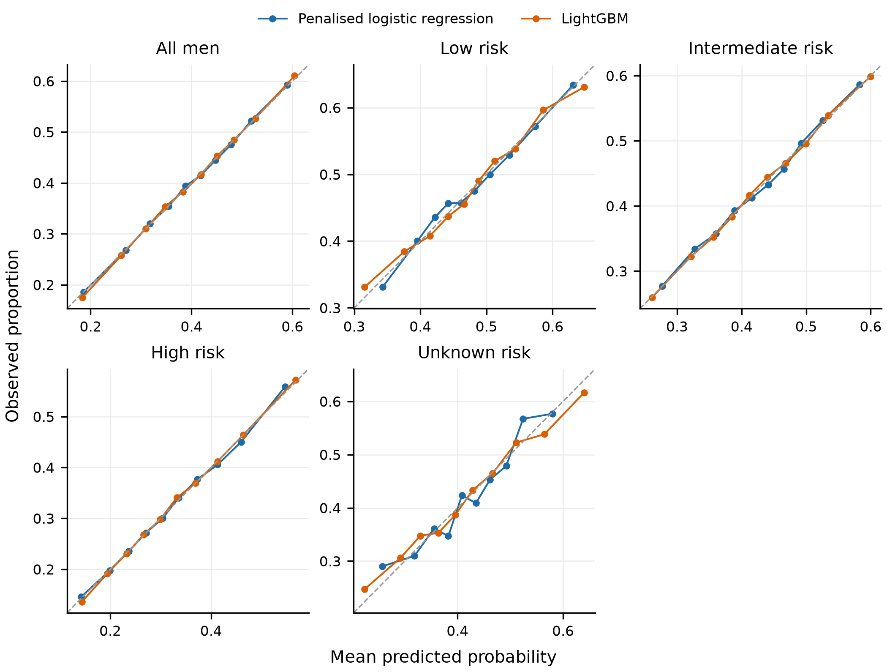
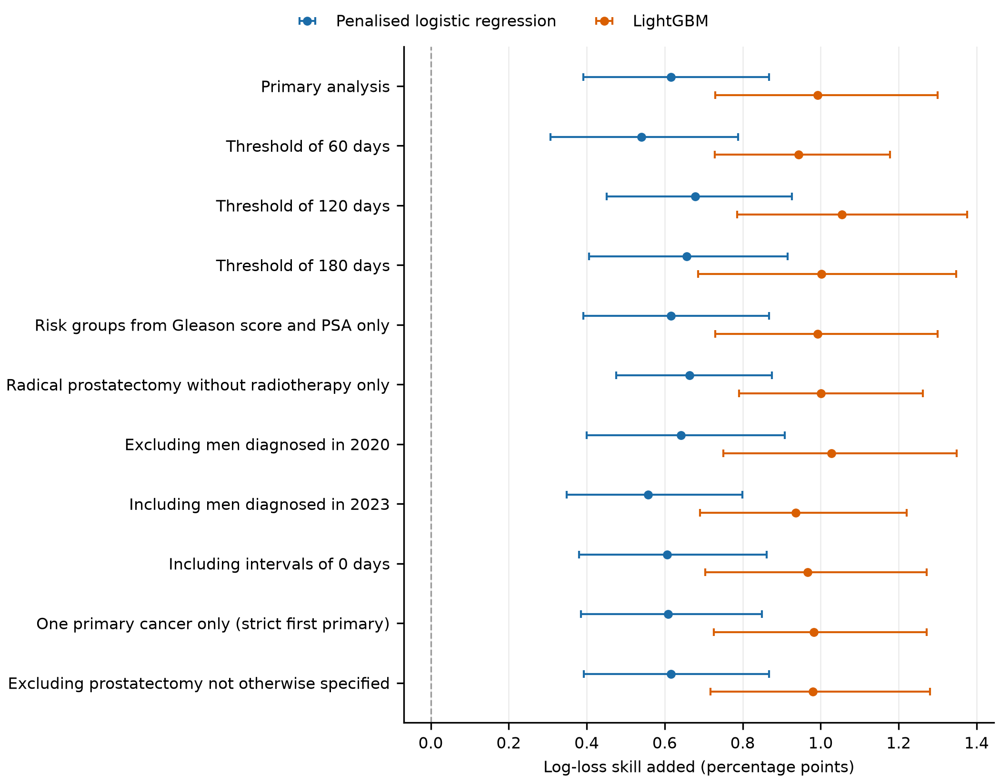

# Supplementary material

**Waiting for prostate cancer treatment: how much is clinical need? A machine learning analysis of social position and time to treatment against the Australian optimal care pathway benchmark, US SEER 2010 to 2022**

How to read this supplement:
- **Source of tables:** every table is copied by script from the generated analysis reports in the code repository, so the tables match the analysis outputs exactly.
- **Numbers of men:** in cross-tabulations they are rounded to the nearest 10.
- **Suppression:** statistics resting on 1 to 4 men are shown as <5.
- **References:** numbered as in the main text.

## Supplementary Box 1. Survival comparisons and immortal time bias (not estimated)

**The problem.** Comparing survival between treated and untreated men is exposed to immortal time bias, because treated men must survive until treatment starts. A simulation study of observational research found three things [23]:
- time-fixed and exclusion methods overestimated a treatment's benefit;
- a 1-year landmark method reduced the bias but did not remove it;
- the time-dependent method was recommended.

**Preferred design**
- Treatment as a time-dependent exposure.
- Competing risks of prostate cancer death and death from other causes.
- A 12-month landmark analysis as a sensitivity analysis only.

This design is described, not estimated, in this study.

## Supplementary Box 2. Candidate Australian equivalents of the SEER variables (no Australian data analysed)

Published analyses of the Prostate Cancer Outcomes Registry in Tasmania used the following measures [2, 3]. Availability for any new study must be confirmed against the registry's data dictionary.
- **Rurality:** the Rural-Urban Continuum Code corresponds to Australian Statistical Geography Standard remoteness areas, assigned by residential postcode.
- **Area income:** county median household income corresponds to the SEIFA Index of Relative Socio-Economic Advantage and Disadvantage, assigned by postcode.
- **Insurance:** SEER has no insurance variable. The closest Australian contrast is a public or private treating facility.

Data gaps reported in those analyses:
- no comorbidity data [2];
- patient-reported outcomes collected consistently only from 2018 [3];
- no way to tell whether external beam radiotherapy was given in a public or private facility [3].

Referral, biopsy and multidisciplinary meeting dates are not assumed to be available.

## Supplementary Table S1. Treated men by interval status
Men meeting cohort steps 1 to 6.

| characteristic | level | Overall | Interval included | 0 days | Missing interval |
|---|---|---|---|---|---|
| Men, n |  | 355,581 | 330,827 | 7,753 | 17,001 |
| Rurality | Metro, 1 million or more | 210,372 (59.2%) | 194,681 (58.8%) | 4,388 (56.6%) | 11,303 (66.5%) |
| Rurality | Metro, 250,000 to 1 million | 77,524 (21.8%) | 72,150 (21.8%) | 1,737 (22.4%) | 3,637 (21.4%) |
| Rurality | Metro, under 250,000 | 27,705 (7.8%) | 26,092 (7.9%) | 652 (8.4%) | 961 (5.7%) |
| Rurality | Nonmetro, adjacent to metro | 24,621 (6.9%) | 23,360 (7.1%) | 567 (7.3%) | 694 (4.1%) |
| Rurality | Nonmetro, not adjacent to metro | 15,188 (4.3%) | 14,385 (4.3%) | 404 (5.2%) | 399 (2.3%) |
| Rurality | Unknown | 171 (0.0%) | 159 (0.0%) | 5 (0.1%) | 7 (0.0%) |
| Age at diagnosis | 40-44 years | 1,547 (0.4%) | 1,480 (0.4%) | 32 (0.4%) | 35 (0.2%) |
| Age at diagnosis | 45-49 years | 7,297 (2.1%) | 6,921 (2.1%) | 128 (1.7%) | 248 (1.5%) |
| Age at diagnosis | 50-54 years | 25,787 (7.3%) | 24,293 (7.3%) | 477 (6.2%) | 1,017 (6.0%) |
| Age at diagnosis | 55-59 years | 52,043 (14.6%) | 49,078 (14.8%) | 894 (11.5%) | 2,071 (12.2%) |
| Age at diagnosis | 60-64 years | 75,120 (21.1%) | 70,459 (21.3%) | 1,368 (17.6%) | 3,293 (19.4%) |
| Age at diagnosis | 65-69 years | 89,835 (25.3%) | 83,831 (25.3%) | 1,769 (22.8%) | 4,235 (24.9%) |
| Age at diagnosis | 70-74 years | 61,150 (17.2%) | 56,371 (17.0%) | 1,473 (19.0%) | 3,306 (19.4%) |
| Age at diagnosis | 75-79 years | 31,004 (8.7%) | 28,114 (8.5%) | 947 (12.2%) | 1,943 (11.4%) |
| Age at diagnosis | 80-84 years | 9,834 (2.8%) | 8,636 (2.6%) | 491 (6.3%) | 707 (4.2%) |
| Age at diagnosis | 85-89 years | 1,792 (0.5%) | 1,516 (0.5%) | 147 (1.9%) | 129 (0.8%) |
| Age at diagnosis | 90+ years | 172 (0.0%) | 128 (0.0%) | 27 (0.3%) | 17 (0.1%) |
| Year of diagnosis | 2010 to 2014 | 138,812 (39.0%) | 126,503 (38.2%) | 2,967 (38.3%) | 9,342 (54.9%) |
| Year of diagnosis | 2015 to 2019 | 131,356 (36.9%) | 122,936 (37.2%) | 3,056 (39.4%) | 5,364 (31.6%) |
| Year of diagnosis | 2020 to 2022 | 85,413 (24.0%) | 81,388 (24.6%) | 1,730 (22.3%) | 2,295 (13.5%) |
| Marital status | Married (including common law) | 249,351 (70.1%) | 232,525 (70.3%) | 5,321 (68.6%) | 11,505 (67.7%) |
| Marital status | Single (never married) | 39,507 (11.1%) | 36,703 (11.1%) | 881 (11.4%) | 1,923 (11.3%) |
| Marital status | Divorced | 23,631 (6.6%) | 22,023 (6.7%) | 565 (7.3%) | 1,043 (6.1%) |
| Marital status | Separated | 2,853 (0.8%) | 2,630 (0.8%) | 67 (0.9%) | 156 (0.9%) |
| Marital status | Widowed | 10,885 (3.1%) | 9,905 (3.0%) | 341 (4.4%) | 639 (3.8%) |
| Marital status | Unmarried or Domestic Partner | 1,447 (0.4%) | 1,369 (0.4%) | 24 (0.3%) | 54 (0.3%) |
| Marital status | Unknown | 27,907 (7.8%) | 25,672 (7.8%) | 554 (7.1%) | 1,681 (9.9%) |
| County median household income (quartile of 16 bands) | Q1 (lowest) | 27,790 (7.8%) | 26,436 (8.0%) | <5 | <5 |
| County median household income (quartile of 16 bands) | Q2 | 86,090 (24.2%) | 79,804 (24.1%) | 1,886 (24.3%) | 4,400 (25.9%) |
| County median household income (quartile of 16 bands) | Q3 | 125,843 (35.4%) | 116,211 (35.1%) | 2,747 (35.4%) | 6,885 (40.5%) |
| County median household income (quartile of 16 bands) | Q4 (highest) | 115,822 (32.6%) | 108,348 (32.8%) | 2,323 (30.0%) | 5,151 (30.3%) |
| County median household income (quartile of 16 bands) | Unknown | 36 (0.0%) | 28 (0.0%) | <5 | <5 |
| Risk group | low | 60,793 (17.1%) | 57,495 (17.4%) | 863 (11.1%) | 2,435 (14.3%) |
| Risk group | intermediate | 134,413 (37.8%) | 127,622 (38.6%) | 1,766 (22.8%) | 5,025 (29.6%) |
| Risk group | high | 141,384 (39.8%) | 130,893 (39.6%) | 3,434 (44.3%) | 7,057 (41.5%) |
| Risk group | unknown | 18,991 (5.3%) | 14,817 (4.5%) | 1,690 (21.8%) | 2,484 (14.6%) |
| Summary stage | Localised | 276,161 (77.7%) | 256,475 (77.5%) | 6,025 (77.7%) | 13,661 (80.4%) |
| Summary stage | Regional, direct extension | 66,083 (18.6%) | 61,984 (18.7%) | 1,301 (16.8%) | 2,798 (16.5%) |
| Summary stage | Regional, lymph nodes | 13,337 (3.8%) | 12,368 (3.7%) | 427 (5.5%) | 542 (3.2%) |
| Clinical Gleason score | 6 or less | 87,024 (24.5%) | 81,630 (24.7%) | 1,406 (18.1%) | 3,988 (23.5%) |
| Clinical Gleason score | 7 | 181,097 (50.9%) | 171,345 (51.8%) | 2,688 (34.7%) | 7,064 (41.6%) |
| Clinical Gleason score | 8 to 10 | 79,786 (22.4%) | 73,447 (22.2%) | 2,164 (27.9%) | 4,175 (24.6%) |
| Clinical Gleason score | Unknown | 7,674 (2.2%) | 4,405 (1.3%) | 1,495 (19.3%) | 1,774 (10.4%) |
| PSA (ng/ml) | below 10 | 236,726 (66.6%) | 223,700 (67.6%) | 3,954 (51.0%) | 9,072 (53.4%) |
| PSA (ng/ml) | 10 to 20 | 62,849 (17.7%) | 58,930 (17.8%) | 984 (12.7%) | 2,935 (17.3%) |
| PSA (ng/ml) | above 20 | 31,563 (8.9%) | 28,789 (8.7%) | 944 (12.2%) | 1,830 (10.8%) |
| PSA (ng/ml) | Unknown | 24,443 (6.9%) | 19,408 (5.9%) | 1,871 (24.1%) | 3,164 (18.6%) |
| First-course treatment | Radical prostatectomy | 170,715 (48.0%) | 159,580 (48.2%) | 3,746 (48.3%) | 7,389 (43.5%) |
| First-course treatment | Radiotherapy | 171,287 (48.2%) | 158,473 (47.9%) | 3,672 (47.4%) | 9,142 (53.8%) |
| First-course treatment | Both | 13,579 (3.8%) | 12,774 (3.9%) | 335 (4.3%) | 470 (2.8%) |

## Supplementary Tables S2 to S6. Crude waiting beyond 90 days
Medians and 90th percentiles treat top-coded intervals as 731 days.

### Supplementary Table S2. By risk group
| risk group | men | % waited over 90 days | median days | 90th percentile days |
|---|---|---|---|---|
| low | 57,495 | 47.9 | 88.0 | 210.0 |
| intermediate | 127,622 | 42.8 | 82.0 | 176.0 |
| high | 130,893 | 32.8 | 70.0 | 150.0 |
| unknown | 14,817 | 42.1 | 79.0 | 212.0 |

### Supplementary Table S3. By risk group and county rurality
| risk group | rurality | men | % waited over 90 days | median days | 90th percentile days |
|---|---|---|---|---|---|
| low | Metro, 1 million or more | 34,260 | 50.7 | 91.0 | 217.0 |
| low | Metro, 250,000 to 1 million | 11,930 | 47.0 | 86.0 | 211.0 |
| low | Metro, under 250,000 | 4,780 | 42.3 | 82.0 | 198.2 |
| low | Nonmetro, adjacent to metro | 3,990 | 39.0 | 77.0 | 187.0 |
| low | Nonmetro, not adjacent to metro | 2,510 | 39.0 | 76.0 | 177.0 |
| low | Unknown | 20 | 34.8 | 81.0 | 122.8 |
| intermediate | Metro, 1 million or more | 75,190 | 45.5 | 84.0 | 182.0 |
| intermediate | Metro, 250,000 to 1 million | 28,140 | 41.1 | 79.0 | 172.0 |
| intermediate | Metro, under 250,000 | 10,070 | 36.7 | 75.0 | 165.0 |
| intermediate | Nonmetro, adjacent to metro | 8,830 | 36.1 | 74.0 | 161.0 |
| intermediate | Nonmetro, not adjacent to metro | 5,360 | 36.1 | 71.0 | 160.0 |
| intermediate | Unknown | 40 | 42.5 | 71.0 | 200.5 |
| high | Metro, 1 million or more | 75,760 | 35.7 | 73.0 | 157.0 |
| high | Metro, 250,000 to 1 million | 29,320 | 30.0 | 67.0 | 142.0 |
| high | Metro, under 250,000 | 10,130 | 27.9 | 65.0 | 140.0 |
| high | Nonmetro, adjacent to metro | 9,590 | 27.7 | 63.0 | 134.5 |
| high | Nonmetro, not adjacent to metro | 6,010 | 26.0 | 62.0 | 133.0 |
| high | Unknown | 90 | 28.4 | 61.5 | 141.5 |
| unknown | Metro, 1 million or more | 9,460 | 44.2 | 82.0 | 224.0 |
| unknown | Metro, 250,000 to 1 million | 2,770 | 42.2 | 80.0 | 203.0 |
| unknown | Metro, under 250,000 | 1,120 | 35.0 | 70.0 | 179.0 |
| unknown | Nonmetro, adjacent to metro | 950 | 36.5 | 72.0 | 174.2 |
| unknown | Nonmetro, not adjacent to metro | 510 | 29.6 | 63.5 | 162.0 |
| unknown | Unknown | 10 | <5 | 77.0 | 212.7 |

### Supplementary Table S4. By risk group and county income quartile
| risk group | county income quartile | men | % waited over 90 days | median days | 90th percentile days |
|---|---|---|---|---|---|
| low | Q1 (lowest) | 5,420 | 37.6 | 76.0 | 182.0 |
| low | Q2 | 15,540 | 44.1 | 83.0 | 196.0 |
| low | Q3 | 19,460 | 50.4 | 91.0 | 216.0 |
| low | Q4 (highest) | 17,070 | 51.9 | 93.0 | 225.0 |
| low | Unknown | <5 | <5 | <5 | <5 |
| intermediate | Q1 (lowest) | 9,930 | 33.5 | 70.0 | 155.0 |
| intermediate | Q2 | 30,100 | 39.3 | 77.0 | 168.0 |
| intermediate | Q3 | 44,260 | 44.9 | 84.0 | 184.0 |
| intermediate | Q4 (highest) | 43,330 | 45.2 | 84.0 | 179.0 |
| intermediate | Unknown | 10 | <5 | 71.0 | 372.2 |
| high | Q1 (lowest) | 9,920 | 26.7 | 63.0 | 134.8 |
| high | Q2 | 30,420 | 30.5 | 67.0 | 145.0 |
| high | Q3 | 46,890 | 35.0 | 71.0 | 156.0 |
| high | Q4 (highest) | 43,650 | 33.4 | 70.0 | 151.0 |
| high | Unknown | 10 | 38.5 | 82.0 | 146.2 |
| unknown | Q1 (lowest) | 1,160 | 31.4 | 65.0 | 175.7 |
| unknown | Q2 | 3,740 | 39.3 | 76.0 | 207.0 |
| unknown | Q3 | 5,610 | 44.6 | 83.0 | 222.5 |
| unknown | Q4 (highest) | 4,300 | 44.4 | 83.0 | 210.0 |
| unknown | Unknown | <5 | <5 | <5 | <5 |

### Supplementary Table S5. By risk group and marital status
| risk group | marital status | men | % waited over 90 days | median days | 90th percentile days |
|---|---|---|---|---|---|
| low | Married (including common law) | 41,490 | 47.0 | 87.0 | 204.0 |
| low | Single (never married) | 5,690 | 51.9 | 93.0 | 226.0 |
| low | Divorced | 3,300 | 50.0 | 90.0 | 220.2 |
| low | Separated | 410 | 52.1 | 92.0 | 231.6 |
| low | Widowed | 1,200 | 42.5 | 83.0 | 196.0 |
| low | Unmarried or Domestic Partner | 160 | 59.9 | 106.5 | 245.0 |
| low | Unknown | 5,250 | 49.8 | 90.0 | 243.0 |
| intermediate | Married (including common law) | 89,430 | 41.3 | 80.0 | 169.2 |
| intermediate | Single (never married) | 14,160 | 49.4 | 90.0 | 197.0 |
| intermediate | Divorced | 8,840 | 47.4 | 87.0 | 190.0 |
| intermediate | Separated | 1,040 | 49.3 | 90.0 | 196.0 |
| intermediate | Widowed | 4,030 | 40.4 | 78.0 | 176.0 |
| intermediate | Unmarried or Domestic Partner | 570 | 49.6 | 90.0 | 194.5 |
| intermediate | Unknown | 9,560 | 42.6 | 81.0 | 189.0 |
| high | Married (including common law) | 92,380 | 30.9 | 68.0 | 143.0 |
| high | Single (never married) | 15,390 | 40.0 | 77.0 | 172.0 |
| high | Divorced | 9,110 | 36.6 | 74.0 | 161.0 |
| high | Separated | 1,110 | 41.4 | 80.0 | 177.0 |
| high | Widowed | 4,320 | 30.9 | 63.0 | 148.0 |
| high | Unmarried or Domestic Partner | 600 | 40.3 | 77.0 | 166.6 |
| high | Unknown | 7,980 | 36.6 | 73.0 | 168.0 |
| unknown | Married (including common law) | 9,230 | 40.2 | 77.0 | 197.4 |
| unknown | Single (never married) | 1,460 | 47.3 | 87.0 | 222.2 |
| unknown | Divorced | 770 | 46.4 | 83.0 | 223.0 |
| unknown | Separated | 80 | 48.1 | 87.0 | 311.0 |
| unknown | Widowed | 360 | 40.0 | 77.0 | 208.6 |
| unknown | Unmarried or Domestic Partner | 40 | 50.0 | 90.0 | 255.0 |
| unknown | Unknown | 2,890 | 44.6 | 82.0 | 253.0 |

### Supplementary Table S6. By year of diagnosis
| year of diagnosis | men | % waited over 90 days | median days | 90th percentile days |
|---|---|---|---|---|
| 2010 | 29,740 | 36.0 | 73.0 | 166.0 |
| 2011 | 29,350 | 35.8 | 73.0 | 161.0 |
| 2012 | 23,830 | 34.0 | 71.0 | 160.0 |
| 2013 | 22,530 | 33.5 | 71.0 | 159.0 |
| 2014 | 21,060 | 34.4 | 72.0 | 160.0 |
| 2015 | 22,530 | 36.2 | 74.0 | 162.0 |
| 2016 | 23,300 | 38.1 | 76.0 | 168.0 |
| 2017 | 24,120 | 39.3 | 77.0 | 164.0 |
| 2018 | 25,730 | 41.4 | 79.0 | 181.0 |
| 2019 | 27,270 | 43.5 | 82.0 | 187.0 |
| 2020 | 23,870 | 41.3 | 79.0 | 178.0 |
| 2021 | 28,750 | 46.3 | 85.0 | 188.0 |
| 2022 | 28,780 | 52.3 | 93.0 | 199.0 |

## Supplementary Table S7. Model performance at every step
AUC: 0.5 is chance. Calibration intercept: 0 is ideal. Calibration slope: 1 is ideal.

| stratum | model | step | log-loss skill % | Brier skill % | AUC | calibration intercept | calibration slope |
|---|---|---|---|---|---|---|---|
| all men (pooled) | penalised logistic regression | 0 | 0.00 | 0.00 | 0.558 | -0.000 | 1.001 |
| all men (pooled) | penalised logistic regression | 1 | 3.01 | 3.89 | 0.628 | -0.000 | 1.002 |
| all men (pooled) | penalised logistic regression | 2 | 3.63 | 4.66 | 0.638 | -0.000 | 1.000 |
| all men (pooled) | penalised logistic regression | 3 | 3.67 | 4.71 | 0.638 | -0.000 | 1.000 |
| all men (pooled) | LightGBM | 0 | 0.00 | 0.00 | 0.561 | -0.000 | 0.997 |
| all men (pooled) | LightGBM | 1 | 3.18 | 4.09 | 0.633 | -0.000 | 1.004 |
| all men (pooled) | LightGBM | 2 | 4.17 | 5.34 | 0.648 | -0.000 | 1.030 |
| all men (pooled) | LightGBM | 3 | 4.46 | 5.70 | 0.653 | -0.000 | 1.041 |
| low risk | penalised logistic regression | 0 | 0.00 | 0.00 | 0.566 | 0.000 | 1.005 |
| low risk | penalised logistic regression | 1 | 0.14 | 0.19 | 0.573 | -0.000 | 0.998 |
| low risk | penalised logistic regression | 2 | 0.76 | 1.03 | 0.592 | 0.000 | 0.988 |
| low risk | penalised logistic regression | 3 | 0.97 | 1.31 | 0.597 | 0.000 | 0.989 |
| low risk | LightGBM | 0 | 0.00 | 0.00 | 0.570 | -0.000 | 0.989 |
| low risk | LightGBM | 1 | 0.02 | 0.04 | 0.577 | -0.000 | 0.883 |
| low risk | LightGBM | 2 | 0.99 | 1.35 | 0.604 | -0.000 | 0.937 |
| low risk | LightGBM | 3 | 1.35 | 1.84 | 0.611 | -0.000 | 0.957 |
| intermediate risk | penalised logistic regression | 0 | 0.00 | 0.00 | 0.581 | 0.000 | 1.003 |
| intermediate risk | penalised logistic regression | 1 | 0.49 | 0.66 | 0.594 | -0.000 | 1.006 |
| intermediate risk | penalised logistic regression | 2 | 1.06 | 1.40 | 0.605 | -0.000 | 1.001 |
| intermediate risk | penalised logistic regression | 3 | 1.09 | 1.45 | 0.606 | -0.000 | 1.001 |
| intermediate risk | LightGBM | 0 | 0.00 | 0.00 | 0.582 | 0.000 | 0.993 |
| intermediate risk | LightGBM | 1 | 0.55 | 0.74 | 0.596 | 0.000 | 0.966 |
| intermediate risk | LightGBM | 2 | 1.48 | 1.96 | 0.615 | -0.000 | 1.008 |
| intermediate risk | LightGBM | 3 | 1.66 | 2.20 | 0.619 | -0.000 | 1.022 |
| high risk | penalised logistic regression | 0 | 0.00 | 0.00 | 0.564 | -0.000 | 1.004 |
| high risk | penalised logistic regression | 1 | 3.53 | 4.41 | 0.641 | -0.000 | 1.002 |
| high risk | penalised logistic regression | 2 | 4.39 | 5.42 | 0.654 | 0.000 | 1.001 |
| high risk | penalised logistic regression | 3 | 4.63 | 5.71 | 0.657 | 0.000 | 1.001 |
| high risk | LightGBM | 0 | 0.00 | 0.00 | 0.565 | -0.000 | 0.993 |
| high risk | LightGBM | 1 | 3.72 | 4.63 | 0.645 | -0.000 | 0.992 |
| high risk | LightGBM | 2 | 4.90 | 6.04 | 0.663 | -0.000 | 1.023 |
| high risk | LightGBM | 3 | 5.28 | 6.49 | 0.668 | -0.000 | 1.033 |
| unknown risk | penalised logistic regression | 0 | 0.00 | 0.00 | 0.584 | -0.000 | 1.019 |
| unknown risk | penalised logistic regression | 1 | 0.65 | 0.89 | 0.601 | -0.000 | 1.022 |
| unknown risk | penalised logistic regression | 2 | 1.07 | 1.43 | 0.610 | 0.000 | 0.982 |
| unknown risk | penalised logistic regression | 3 | 1.41 | 1.86 | 0.616 | 0.000 | 0.980 |
| unknown risk | LightGBM | 0 | 0.00 | 0.00 | 0.585 | -0.000 | 0.946 |
| unknown risk | LightGBM | 1 | 0.59 | 0.83 | 0.601 | -0.001 | 0.850 |
| unknown risk | LightGBM | 2 | 1.96 | 2.64 | 0.629 | -0.000 | 0.882 |
| unknown risk | LightGBM | 3 | 2.67 | 3.54 | 0.640 | -0.000 | 0.901 |

## Supplementary Table S8. Skill lost when one social variable is removed from step 2
Rurality and county income are strongly correlated, so removing one lets the other partly stand in for it.

| stratum | model | variable removed | skill lost when removed (points) |
|---|---|---|---|
| all men (pooled) | penalised logistic regression | marital status | 0.22 |
| all men (pooled) | penalised logistic regression | rurality | 0.23 |
| all men (pooled) | penalised logistic regression | county income | 0.00 |
| all men (pooled) | LightGBM | marital status | 0.27 |
| all men (pooled) | LightGBM | rurality | 0.23 |
| all men (pooled) | LightGBM | county income | 0.26 |
| low risk | penalised logistic regression | marital status | 0.05 |
| low risk | penalised logistic regression | rurality | 0.13 |
| low risk | penalised logistic regression | county income | 0.09 |
| low risk | LightGBM | marital status | 0.05 |
| low risk | LightGBM | rurality | 0.10 |
| low risk | LightGBM | county income | 0.38 |
| intermediate risk | penalised logistic regression | marital status | 0.18 |
| intermediate risk | penalised logistic regression | rurality | 0.19 |
| intermediate risk | penalised logistic regression | county income | 0.01 |
| intermediate risk | LightGBM | marital status | 0.21 |
| intermediate risk | LightGBM | rurality | 0.22 |
| intermediate risk | LightGBM | county income | 0.29 |
| high risk | penalised logistic regression | marital status | 0.42 |
| high risk | penalised logistic regression | rurality | 0.37 |
| high risk | penalised logistic regression | county income | 0.02 |
| high risk | LightGBM | marital status | 0.45 |
| high risk | LightGBM | rurality | 0.36 |
| high risk | LightGBM | county income | 0.26 |
| unknown risk | penalised logistic regression | marital status | 0.16 |
| unknown risk | penalised logistic regression | rurality | 0.12 |
| unknown risk | penalised logistic regression | county income | -0.03 |
| unknown risk | LightGBM | marital status | 0.41 |
| unknown risk | LightGBM | rurality | 0.16 |
| unknown risk | LightGBM | county income | 0.59 |

## Supplementary Table S9. Tuned hyperparameters

| stratum | model | max_iter | C | seconds | learning_rate | n_estimators | num_leaves | min_child_samples |
|---|---|---|---|---|---|---|---|---|
| all men (pooled) | penalised logistic regression | 2000 | 0.01 | 1.9 | n/a | n/a | n/a | n/a |
| all men (pooled) | LightGBM | n/a | n/a | 41.6 | 0.05 | 200 | 15 | 200 |
| low risk | penalised logistic regression | 2000 | 0.01 | 1.3 | n/a | n/a | n/a | n/a |
| low risk | LightGBM | n/a | n/a | 40.7 | 0.05 | 200 | 15 | 200 |
| intermediate risk | penalised logistic regression | 2000 | 0.01 | 1.4 | n/a | n/a | n/a | n/a |
| intermediate risk | LightGBM | n/a | n/a | 40.5 | 0.05 | 200 | 15 | 200 |
| high risk | penalised logistic regression | 2000 | 0.01 | 1.9 | n/a | n/a | n/a | n/a |
| high risk | LightGBM | n/a | n/a | 42.4 | 0.05 | 200 | 15 | 200 |
| unknown risk | penalised logistic regression | 2000 | 0.01 | 0.4 | n/a | n/a | n/a | n/a |
| unknown risk | LightGBM | n/a | n/a | 30.7 | 0.05 | 200 | 15 | 200 |

## Supplementary Table S10. Standardised percentage waiting more than 90 days by profile, all men

| profile | penalised logistic regression | LightGBM |
|---|---|---|
| as observed | 39.7 | 39.7 |
| reference profile | 40.8 | 41.3 |
| area: Metro, 1 million or more, typical county income ($90,000 - $94,999) | 40.6 | 41.1 |
| area: Metro, 250,000 to 1 million, typical county income ($80,000 - $84,999) | 36.3 | 36.9 |
| area: Metro, under 250,000, typical county income ($65,000 - $69,999) | 32.8 | 32.4 |
| area: Nonmetro, adjacent to metro, typical county income ($55,000 - $59,999) | 31.8 | 31.9 |
| area: Nonmetro, not adjacent to metro, typical county income ($55,000 - $59,999) | 31.4 | 32.4 |
| marital status: Married (including common law) | 40.8 | 41.3 |
| marital status: Single (never married) | 47.5 | 47.2 |
| marital status: Divorced | 46.9 | 46.7 |
| marital status: Separated | 49.4 | 46.9 |
| marital status: Widowed | 42.7 | 44.0 |
| marital status: Unmarried or Domestic Partner | 46.7 | 45.9 |
| marital status: Unknown | 45.6 | 45.7 |

## Supplementary Table S11. Crude excess waiting days beyond 90 days per 1,000 men

| stratum | variable | group | men | excess days per 1,000 men (crude) |
|---|---|---|---|---|
| all men (pooled) | rurality | Metro, 1 million or more | 194,680 | 30,597 |
| all men (pooled) | rurality | Metro, 250,000 to 1 million | 72,150 | 26,040 |
| all men (pooled) | rurality | Metro, under 250,000 | 26,090 | 24,387 |
| all men (pooled) | rurality | Nonmetro, adjacent to metro | 23,360 | 21,678 |
| all men (pooled) | rurality | Nonmetro, not adjacent to metro | 14,390 | 20,014 |
| all men (pooled) | rurality | Unknown | 160 | 24,258 |
| all men (pooled) | county income quartile | Q1 (lowest) | 26,440 | 22,045 |
| all men (pooled) | county income quartile | Q2 | 79,800 | 25,568 |
| all men (pooled) | county income quartile | Q3 | 116,210 | 30,250 |
| all men (pooled) | county income quartile | Q4 (highest) | 108,350 | 28,889 |
| all men (pooled) | county income quartile | Unknown | 30 | 45,571 |
| high risk | rurality | Metro, 1 million or more | 75,760 | 21,912 |
| high risk | rurality | Metro, 250,000 to 1 million | 29,320 | 17,331 |
| high risk | rurality | Metro, under 250,000 | 10,130 | 16,770 |
| high risk | rurality | Nonmetro, adjacent to metro | 9,590 | 15,316 |
| high risk | rurality | Nonmetro, not adjacent to metro | 6,010 | 13,553 |
| high risk | rurality | Unknown | 90 | 11,216 |
| high risk | county income quartile | Q1 (lowest) | 9,920 | 15,461 |
| high risk | county income quartile | Q2 | 30,420 | 17,899 |
| high risk | county income quartile | Q3 | 46,890 | 21,596 |
| high risk | county income quartile | Q4 (highest) | 43,650 | 19,625 |
| high risk | county income quartile | Unknown | 10 | 18,462 |

## Supplementary Table S12. Erreygers concentration index by risk group

| stratum | Erreygers index (95% interval) |
|---|---|
| all men (pooled) | 0.062 (0.039 to 0.083) |
| low risk | 0.103 (0.068 to 0.134) |
| intermediate risk | 0.075 (0.051 to 0.096) |
| high risk | 0.041 (0.017 to 0.065) |
| unknown risk | 0.077 (0.037 to 0.128) |

## Supplementary Tables S13 to S16. Bounds for men without a recorded interval
The lower bound assumes every man without a recorded interval waited 90 days or less; the upper bound assumes every such man waited longer.

### Supplementary Table S13. By risk group
| risk group | men | % over 90 days (recorded men) | lower bound % | upper bound % | % with no recorded interval |
|---|---|---|---|---|---|
| low | 59,930 | 47.9 | 46.0 | 50.0 | 4.1 |
| intermediate | 132,650 | 42.8 | 41.2 | 44.9 | 3.8 |
| high | 137,950 | 32.8 | 31.1 | 36.2 | 5.1 |
| unknown | 17,300 | 42.1 | 36.1 | 50.5 | 14.4 |

### Supplementary Table S14. By rurality
| rurality | men | % over 90 days (recorded men) | lower bound % | upper bound % | % with no recorded interval |
|---|---|---|---|---|---|
| Metro, 1 million or more | 205,980 | 42.5 | 40.2 | 45.7 | 5.5 |
| Metro, 250,000 to 1 million | 75,790 | 37.6 | 35.8 | 40.6 | 4.8 |
| Metro, under 250,000 | 27,050 | 34.2 | 33.0 | 36.6 | 3.6 |
| Nonmetro, adjacent to metro | 24,050 | 33.2 | 32.2 | 35.1 | 2.9 |
| Nonmetro, not adjacent to metro | 14,780 | 32.2 | 31.3 | 34.0 | 2.7 |
| Unknown | 170 | 33.3 | 31.9 | 36.1 | 4.2 |

### Supplementary Table S15. By county income quartile
| county income quartile | men | % over 90 days (recorded men) | lower bound % | upper bound % | % with no recorded interval |
|---|---|---|---|---|---|
| Q1 (lowest) | 27,000 | 31.7 | 31.0 | 33.1 | 2.1 |
| Q2 | 84,200 | 36.9 | 35.0 | 40.2 | 5.2 |
| Q3 | 123,100 | 41.8 | 39.5 | 45.1 | 5.6 |
| Q4 (highest) | 113,500 | 41.4 | 39.6 | 44.1 | 4.5 |
| Unknown | 30 | 39.3 | 32.4 | 50.0 | 17.6 |

### Supplementary Table S16. By marital status
| marital status | men | % over 90 days (recorded men) | lower bound % | upper bound % | % with no recorded interval |
|---|---|---|---|---|---|
| Married (including common law) | 244,030 | 38.1 | 36.3 | 41.0 | 4.7 |
| Single (never married) | 38,630 | 45.7 | 43.5 | 48.4 | 5.0 |
| Divorced | 23,070 | 43.3 | 41.3 | 45.8 | 4.5 |
| Separated | 2,790 | 46.3 | 43.8 | 49.4 | 5.6 |
| Widowed | 10,540 | 36.5 | 34.3 | 40.3 | 6.1 |
| Unmarried or Domestic Partner | 1,420 | 46.7 | 45.0 | 48.8 | 3.8 |
| Unknown | 27,350 | 42.4 | 39.8 | 46.0 | 6.1 |

## Supplementary Table S17. Skill added in predicting a missing interval

| comparison | skill added, percentage points (95% interval) |
|---|---|
| clinical need (step 0 to 1) | 4.99 (4.51 to 5.42) |
| social position (step 1 to 2) | 0.53 (0.07 to 1.02) |

## Supplementary Table S18. Inverse probability weighted percentages

| variable | group | men | % over 90 days (unweighted) | % over 90 days (weighted) |
|---|---|---|---|---|
| rurality | Metro, 1 million or more | 194,680 | 42.5 | 42.3 |
| rurality | Metro, 250,000 to 1 million | 72,150 | 37.6 | 37.4 |
| rurality | Metro, under 250,000 | 26,090 | 34.2 | 34.1 |
| rurality | Nonmetro, adjacent to metro | 23,360 | 33.2 | 33.1 |
| rurality | Nonmetro, not adjacent to metro | 14,390 | 32.2 | 32.0 |
| rurality | Unknown | 160 | 33.3 | 33.5 |
| county income quartile | Q1 (lowest) | 26,440 | 31.7 | 31.5 |
| county income quartile | Q2 | 79,800 | 36.9 | 36.8 |
| county income quartile | Q3 | 116,210 | 41.8 | 41.6 |
| county income quartile | Q4 (highest) | 108,350 | 41.4 | 41.3 |
| county income quartile | Unknown | 30 | 39.3 | 39.6 |
| marital status | Married (including common law) | 232,530 | 38.1 | 38.0 |
| marital status | Single (never married) | 36,700 | 45.7 | 45.5 |
| marital status | Divorced | 22,020 | 43.3 | 43.1 |
| marital status | Separated | 2,630 | 46.3 | 46.2 |
| marital status | Widowed | 9,910 | 36.5 | 36.3 |
| marital status | Unmarried or Domestic Partner | 1,370 | 46.7 | 46.6 |
| marital status | Unknown | 25,670 | 42.4 | 42.4 |

## Supplementary Tables S19 to S24. Sensitivity analyses

### Supplementary Table S19. Percentage waiting beyond the threshold, by scenario
| scenario | threshold (days) | men | % over threshold, all men | % over threshold, low risk | % over threshold, intermediate risk | % over threshold, high risk | % over threshold, unknown risk |
|---|---|---|---|---|---|---|---|
| primary analysis | 90 | 330,830 | 39.7 | 47.9 | 42.8 | 32.8 | 42.1 |
| threshold of 60 days | 60 | 330,830 | 66.6 | 75.0 | 70.0 | 59.5 | 66.7 |
| threshold of 120 days | 120 | 330,830 | 23.0 | 30.3 | 24.8 | 17.5 | 26.8 |
| threshold of 180 days | 180 | 330,830 | 9.1 | 13.9 | 9.5 | 6.1 | 13.3 |
| risk groups from Gleason score and PSA only | 90 | 330,830 | 39.7 | 47.7 | 42.6 | 28.2 | 41.7 |
| radical prostatectomy without radiotherapy only | 90 | 159,580 | 41.1 | 45.8 | 42.3 | 38.4 | 38.2 |
| excluding men diagnosed in 2020 | 90 | 306,960 | 39.6 | 47.4 | 42.5 | 32.9 | 41.7 |
| including men diagnosed in 2023 | 90 | 358,540 | 40.8 | 48.4 | 44.2 | 34.0 | 43.5 |
| including intervals of 0 days | 90 | 338,580 | 38.8 | 47.2 | 42.2 | 32.0 | 37.8 |
| one primary cancer only (strict first primary) | 90 | 296,120 | 40.1 | 48.3 | 43.2 | 33.2 | 42.7 |
| excluding prostatectomy not otherwise specified | 90 | 330,180 | 39.7 | 47.9 | 42.8 | 32.8 | 42.2 |

### Supplementary Table S20. Social position increment by scenario
| scenario | model | all men (pooled) | low risk | intermediate risk | high risk | unknown risk |
|---|---|---|---|---|---|---|
| primary analysis | penalised logistic regression | 0.62 (0.39 to 0.87) | 0.62 (0.32 to 0.94) | 0.56 (0.35 to 0.83) | 0.86 (0.60 to 1.15) | 0.42 (0.08 to 0.80) |
| primary analysis | LightGBM | 0.99 (0.73 to 1.30) | 0.96 (0.67 to 1.28) | 0.93 (0.65 to 1.27) | 1.18 (0.90 to 1.56) | 1.37 (0.80 to 2.19) |
| threshold of 60 days | penalised logistic regression | 0.54 (0.31 to 0.79) | 0.82 (0.38 to 1.27) | 0.53 (0.28 to 0.82) | 0.61 (0.39 to 0.86) | 0.41 (0.06 to 0.86) |
| threshold of 60 days | LightGBM | 0.94 (0.73 to 1.18) | 1.22 (0.86 to 1.67) | 0.88 (0.66 to 1.16) | 0.96 (0.75 to 1.21) | 1.56 (0.90 to 2.36) |
| threshold of 120 days | penalised logistic regression | 0.68 (0.45 to 0.93) | 0.60 (0.31 to 0.90) | 0.58 (0.37 to 0.82) | 1.02 (0.75 to 1.33) | 0.52 (0.10 to 1.00) |
| threshold of 120 days | LightGBM | 1.06 (0.79 to 1.38) | 0.97 (0.69 to 1.23) | 0.90 (0.58 to 1.25) | 1.39 (1.10 to 1.77) | 1.47 (0.71 to 2.40) |
| threshold of 180 days | penalised logistic regression | 0.66 (0.41 to 0.92) | 0.56 (0.32 to 0.82) | 0.58 (0.33 to 0.83) | 0.96 (0.64 to 1.31) | 0.58 (0.00 to 1.19) |
| threshold of 180 days | LightGBM | 1.00 (0.69 to 1.35) | 0.84 (0.56 to 1.10) | 0.93 (0.60 to 1.33) | 1.40 (1.05 to 1.81) | 1.33 (0.14 to 2.85) |
| risk groups from Gleason score and PSA only | penalised logistic regression | 0.62 (0.39 to 0.87) | 0.67 (0.34 to 1.01) | 0.58 (0.38 to 0.82) | 0.94 (0.65 to 1.28) | 0.51 (0.16 to 0.87) |
| risk groups from Gleason score and PSA only | LightGBM | 0.99 (0.73 to 1.30) | 1.02 (0.71 to 1.32) | 0.92 (0.67 to 1.23) | 1.34 (1.00 to 1.78) | 1.21 (0.59 to 1.92) |
| radical prostatectomy without radiotherapy only | penalised logistic regression | 0.66 (0.48 to 0.88) | 0.71 (0.47 to 1.07) | 0.59 (0.37 to 0.83) | 0.77 (0.56 to 0.99) | 0.62 (0.19 to 1.01) |
| radical prostatectomy without radiotherapy only | LightGBM | 1.00 (0.79 to 1.26) | 0.88 (0.60 to 1.19) | 0.90 (0.65 to 1.20) | 1.07 (0.85 to 1.36) | 0.74 (-0.13 to 1.42) |
| excluding men diagnosed in 2020 | penalised logistic regression | 0.64 (0.40 to 0.91) | 0.59 (0.28 to 0.97) | 0.58 (0.33 to 0.86) | 0.89 (0.62 to 1.20) | 0.43 (0.03 to 0.83) |
| excluding men diagnosed in 2020 | LightGBM | 1.03 (0.75 to 1.35) | 0.95 (0.67 to 1.27) | 0.98 (0.66 to 1.35) | 1.20 (0.91 to 1.58) | 1.33 (0.61 to 2.21) |
| including men diagnosed in 2023 | penalised logistic regression | 0.56 (0.35 to 0.80) | 0.57 (0.27 to 0.89) | 0.51 (0.31 to 0.75) | 0.76 (0.51 to 1.04) | 0.39 (0.08 to 0.75) |
| including men diagnosed in 2023 | LightGBM | 0.94 (0.69 to 1.22) | 0.98 (0.72 to 1.28) | 0.87 (0.61 to 1.19) | 1.10 (0.86 to 1.46) | 1.17 (0.54 to 1.95) |
| including intervals of 0 days | penalised logistic regression | 0.61 (0.38 to 0.86) | 0.63 (0.32 to 0.95) | 0.55 (0.33 to 0.81) | 0.83 (0.57 to 1.12) | 0.52 (0.16 to 0.91) |
| including intervals of 0 days | LightGBM | 0.97 (0.70 to 1.27) | 1.04 (0.77 to 1.35) | 0.92 (0.63 to 1.26) | 1.14 (0.87 to 1.50) | 1.31 (0.65 to 2.16) |
| one primary cancer only (strict first primary) | penalised logistic regression | 0.61 (0.38 to 0.85) | 0.63 (0.33 to 0.95) | 0.54 (0.32 to 0.79) | 0.85 (0.59 to 1.12) | 0.40 (-0.04 to 0.79) |
| one primary cancer only (strict first primary) | LightGBM | 0.98 (0.73 to 1.27) | 0.98 (0.71 to 1.27) | 0.90 (0.62 to 1.24) | 1.22 (0.93 to 1.58) | 1.39 (0.70 to 2.26) |
| excluding prostatectomy not otherwise specified | penalised logistic regression | 0.62 (0.39 to 0.87) | 0.61 (0.30 to 0.94) | 0.54 (0.32 to 0.80) | 0.86 (0.59 to 1.15) | 0.52 (0.15 to 0.93) |
| excluding prostatectomy not otherwise specified | LightGBM | 0.98 (0.72 to 1.28) | 1.03 (0.76 to 1.32) | 0.93 (0.65 to 1.28) | 1.19 (0.92 to 1.55) | 1.37 (0.74 to 2.13) |

### Supplementary Table S21. Standardised area contrast by scenario, all men
| scenario | penalised logistic regression | LightGBM | agreement |
|---|---|---|---|
| primary analysis | -9.2 | -8.8 | both models 3 points or more, same direction |
| threshold of 60 days | -10.6 | -10.3 | both models 3 points or more, same direction |
| threshold of 120 days | -6.9 | -7.1 | both models 3 points or more, same direction |
| threshold of 180 days | -3.0 | -3.2 | models disagree |
| risk groups from Gleason score and PSA only | -9.2 | -8.8 | both models 3 points or more, same direction |
| radical prostatectomy without radiotherapy only | -8.9 | -7.8 | both models 3 points or more, same direction |
| excluding men diagnosed in 2020 | -9.4 | -8.9 | both models 3 points or more, same direction |
| including men diagnosed in 2023 | -8.6 | -8.3 | both models 3 points or more, same direction |
| including intervals of 0 days | -9.2 | -9.2 | both models 3 points or more, same direction |
| one primary cancer only (strict first primary) | -9.1 | -9.3 | both models 3 points or more, same direction |
| excluding prostatectomy not otherwise specified | -9.2 | -9.1 | both models 3 points or more, same direction |

### Supplementary Table S22. Standardised marital status contrast by scenario, all men
| scenario | penalised logistic regression | LightGBM | agreement |
|---|---|---|---|
| primary analysis | 6.7 | 5.9 | both models 3 points or more, same direction |
| threshold of 60 days | 3.7 | 3.2 | both models 3 points or more, same direction |
| threshold of 120 days | 6.0 | 5.0 | both models 3 points or more, same direction |
| threshold of 180 days | 3.4 | 3.1 | both models 3 points or more, same direction |
| risk groups from Gleason score and PSA only | 6.7 | 5.9 | both models 3 points or more, same direction |
| radical prostatectomy without radiotherapy only | 7.1 | 6.9 | both models 3 points or more, same direction |
| excluding men diagnosed in 2020 | 6.8 | 5.9 | both models 3 points or more, same direction |
| including men diagnosed in 2023 | 6.4 | 5.8 | both models 3 points or more, same direction |
| including intervals of 0 days | 6.5 | 5.8 | both models 3 points or more, same direction |
| one primary cancer only (strict first primary) | 6.6 | 5.6 | both models 3 points or more, same direction |
| excluding prostatectomy not otherwise specified | 6.7 | 5.9 | both models 3 points or more, same direction |

### Supplementary Table S23. All social features as observed minus the reference profile, by scenario, all men
| scenario | penalised logistic regression | LightGBM | agreement |
|---|---|---|---|
| primary analysis | -1.1 | -1.6 | both models under 3 points |
| threshold of 60 days | -1.7 | -2.8 | both models under 3 points |
| threshold of 120 days | -0.6 | -0.6 | both models under 3 points |
| threshold of 180 days | 0.1 | 0.3 | both models under 3 points |
| risk groups from Gleason score and PSA only | -1.1 | -1.6 | both models under 3 points |
| radical prostatectomy without radiotherapy only | -1.5 | -1.1 | both models under 3 points |
| excluding men diagnosed in 2020 | -1.1 | -1.6 | both models under 3 points |
| including men diagnosed in 2023 | -1.0 | -1.6 | both models under 3 points |
| including intervals of 0 days | -1.1 | -1.6 | both models under 3 points |
| one primary cancer only (strict first primary) | -1.1 | -1.6 | both models under 3 points |
| excluding prostatectomy not otherwise specified | -1.1 | -1.6 | both models under 3 points |

### Supplementary Table S24. Penalised logistic regression with a wider C grid (post hoc)
| stratum | C chosen (wider grid) | at an edge of the wider grid | logistic step 2 skill, original grid | logistic step 2 skill, wider grid | LightGBM step 2 skill | social position added, original grid | social position added, wider grid |
|---|---|---|---|---|---|---|---|
| all men (pooled) | 0.01 | no | 3.63 | 3.63 | 4.17 | 0.62 (0.39 to 0.87) | 0.62 (0.39 to 0.87) |
| low risk | 0.01 | no | 0.76 | 0.76 | 0.99 | 0.62 (0.32 to 0.94) | 0.62 (0.32 to 0.94) |
| intermediate risk | 0.01 | no | 1.06 | 1.06 | 1.48 | 0.56 (0.35 to 0.83) | 0.56 (0.35 to 0.83) |
| high risk | 0.01 | no | 4.39 | 4.39 | 4.90 | 0.86 (0.60 to 1.15) | 0.86 (0.60 to 1.15) |
| unknown risk | 0.01 | no | 1.07 | 1.07 | 1.96 | 0.42 (0.08 to 0.80) | 0.42 (0.08 to 0.80) |

## Supplementary Tables S25 to S31. Secondary outcome: recorded curative treatment
**What the outcome means.** No record can mean active surveillance, watchful waiting, hormone therapy only, refusal, or treatment the registry did not capture. A lower percentage cannot be read as under-treatment.

### Supplementary Table S25. By risk group
| risk group | men | % with a recorded curative treatment |
|---|---|---|
| intermediate | 178,250 | 75.4 |
| high | 174,390 | 81.1 |

### Supplementary Table S26. By risk group and county rurality
| risk group | rurality | men | % with a recorded curative treatment |
|---|---|---|---|
| intermediate | Metro, 1 million or more | 104,530 | 76.0 |
| intermediate | Metro, 250,000 to 1 million | 39,410 | 75.3 |
| intermediate | Metro, under 250,000 | 14,100 | 74.5 |
| intermediate | Nonmetro, adjacent to metro | 12,430 | 73.9 |
| intermediate | Nonmetro, not adjacent to metro | 7,700 | 72.3 |
| intermediate | Unknown | 80 | 53.2 |
| high | Metro, 1 million or more | 100,450 | 81.9 |
| high | Metro, 250,000 to 1 million | 38,520 | 82.1 |
| high | Metro, under 250,000 | 13,730 | 78.9 |
| high | Nonmetro, adjacent to metro | 13,060 | 77.7 |
| high | Nonmetro, not adjacent to metro | 8,490 | 75.3 |
| high | Unknown | 150 | 63.9 |

### Supplementary Table S27. By risk group and county income quartile
| risk group | county income quartile | men | % with a recorded curative treatment |
|---|---|---|---|
| intermediate | Q1 (lowest) | 14,140 | 72.7 |
| intermediate | Q2 | 42,320 | 75.1 |
| intermediate | Q3 | 61,910 | 75.7 |
| intermediate | Q4 (highest) | 59,870 | 76.0 |
| intermediate | Unknown | 20 | 36.4 |
| high | Q1 (lowest) | 14,280 | 73.7 |
| high | Q2 | 41,500 | 79.6 |
| high | Q3 | 62,280 | 82.0 |
| high | Q4 (highest) | 56,310 | 83.0 |
| high | Unknown | 30 | 51.6 |

### Supplementary Table S28. By risk group and marital status
| risk group | marital status | men | % with a recorded curative treatment |
|---|---|---|---|
| intermediate | Married (including common law) | 118,930 | 79.0 |
| intermediate | Single (never married) | 20,560 | 72.8 |
| intermediate | Divorced | 12,520 | 74.5 |
| intermediate | Separated | 1,550 | 71.4 |
| intermediate | Widowed | 6,020 | 71.0 |
| intermediate | Unmarried or Domestic Partner | 790 | 74.6 |
| intermediate | Unknown | 17,890 | 56.8 |
| high | Married (including common law) | 115,360 | 86.2 |
| high | Single (never married) | 20,970 | 79.2 |
| high | Divorced | 12,170 | 80.7 |
| high | Separated | 1,560 | 78.2 |
| high | Widowed | 7,450 | 64.7 |
| high | Unmarried or Domestic Partner | 730 | 86.5 |
| high | Unknown | 16,140 | 54.7 |

### Supplementary Table S29. Value added at each step
| stratum | model | skill at step 2 | clinical need added | social position added | social position as % of step 2 skill | AUC at step 2 | calibration slope at step 2 |
|---|---|---|---|---|---|---|---|
| intermediate and high risk (pooled) | penalised logistic regression | 17.18 | 15.22 (14.85 to 15.65) | 1.96 (1.72 to 2.31) | 11 | 0.771 | 1.00 |
| intermediate and high risk (pooled) | LightGBM | 20.49 | 18.32 (17.92 to 18.77) | 2.16 (1.92 to 2.54) | 11 | 0.791 | 1.02 |
| intermediate risk | penalised logistic regression | 8.79 | 6.81 (6.38 to 7.21) | 1.97 (1.65 to 2.42) | 22 | 0.692 | 1.00 |
| intermediate risk | LightGBM | 10.14 | 7.83 (7.42 to 8.20) | 2.31 (1.99 to 2.82) | 23 | 0.703 | 1.02 |
| high risk | penalised logistic regression | 29.29 | 27.25 (26.63 to 27.96) | 2.04 (1.84 to 2.33) | 7 | 0.854 | 1.00 |
| high risk | LightGBM | 31.76 | 29.54 (28.94 to 30.17) | 2.22 (2.00 to 2.53) | 7 | 0.865 | 1.01 |

### Supplementary Table S30. Standardised contrasts
| stratum | contrast | penalised logistic regression | LightGBM | agreement |
|---|---|---|---|---|
| intermediate and high risk (pooled) | all social features as observed minus reference profile | -4.3 | -3.5 | both models 3 points or more, same direction |
| intermediate and high risk (pooled) | area: Nonmetro, not adjacent to metro minus Metro, 1 million or more, each at its typical county income | -2.9 | -1.4 | both models under 3 points |
| intermediate and high risk (pooled) | marital status: Single (never married) minus Married (including common law) | -6.5 | -5.9 | both models 3 points or more, same direction |
| intermediate risk | all social features as observed minus reference profile | -4.2 | -3.2 | both models 3 points or more, same direction |
| intermediate risk | area: Nonmetro, not adjacent to metro minus Metro, 1 million or more, each at its typical county income | -2.2 | -0.3 | both models under 3 points |
| intermediate risk | marital status: Single (never married) minus Married (including common law) | -7.2 | -6.4 | both models 3 points or more, same direction |
| high risk | all social features as observed minus reference profile | -4.3 | -3.8 | both models 3 points or more, same direction |
| high risk | area: Nonmetro, not adjacent to metro minus Metro, 1 million or more, each at its typical county income | -3.3 | -2.5 | models disagree |
| high risk | marital status: Single (never married) minus Married (including common law) | -5.8 | -5.1 | both models 3 points or more, same direction |

### Supplementary Table S31. Standardised percentages by profile, intermediate and high risk pooled
| profile | penalised logistic regression | LightGBM |
|---|---|---|
| as observed | 78.2 | 78.2 |
| reference profile | 82.5 | 81.7 |
| area: Metro, 1 million or more, typical county income ($90,000 - $94,999) | 82.1 | 81.5 |
| area: Metro, 250,000 to 1 million, typical county income ($80,000 - $84,999) | 81.5 | 81.6 |
| area: Metro, under 250,000, typical county income ($65,000 - $69,999) | 80.7 | 81.1 |
| area: Nonmetro, adjacent to metro, typical county income ($55,000 - $59,999) | 79.7 | 80.1 |
| area: Nonmetro, not adjacent to metro, typical county income ($55,000 - $59,999) | 79.2 | 80.1 |
| marital status: Married (including common law) | 82.5 | 81.7 |
| marital status: Single (never married) | 76.0 | 75.9 |
| marital status: Divorced | 78.1 | 77.1 |
| marital status: Separated | 75.5 | 75.9 |
| marital status: Widowed | 78.4 | 78.3 |
| marital status: Unmarried or Domestic Partner | 79.8 | 77.4 |
| marital status: Unknown | 65.0 | 66.9 |

## Supplementary Table S32. Protocol amendment log

| date | amendment | reason |
|---|---|---|
| 2026-09-13 | Timeliness made the primary question; treatment receipt secondary; survival reduced to a methods box | Strongest data, closest match to the intended audience, and time available |
| 2026-09-13 | Analysis built on the current export without race, Type of Reporting Source or histology | Re-export not available before the application deadline; death-certificate proxy and stated limitations used instead |
| 2026-09-13 | Modality moved after social position; ordered steps replace order-invariant decomposition; binary outcome only; cohort limited to 2010 to 2022; 0-day intervals excluded; cluster bootstrap over rurality by income cells | Independent design review: modality partly carries social effects; every treated man has the event, so survival framing does not apply; follow-up truncation; county-level exposures |
| 2026-09-13 | Selection statement corrected: no age filter was applied at export | Session file inspection (reports/phase1.md) |
| 2026-09-13 | Title changed to name the machine learning approach (version 1.1) | Clarity about methods; no change to the cohort, definitions, estimand or analyses |
| 2026-09-13 | Wording clarified: no Australian data are analysed; Tasmanian findings are cited as background only; Australian registry variables are candidate equivalents to be confirmed (version 1.2) | Avoid implying a cross-country comparison or unverified registry contents; no change to the cohort, definitions, estimand or analyses |
| 2026-09-13 | Survival methods box (A10) now prefers a time-dependent treatment exposure, with the 12-month landmark as a sensitivity analysis only; citations added for Leong 2025, Usman 2026 and Zheng 2023; references section added (version 1.3) | Simulation evidence that landmark methods only partly remove immortal time bias (Zheng et al. 2023). A10 is not estimated, so no result changes |
| 2026-09-13 | Citations checked against full texts where available: Tasmanian findings restated with the published medians, mean differences and confidence intervals; the radiotherapy exclusion in Foley et al. 2025 stated; A11 updated with the area measures and data gaps reported in published PCOR-TAS analyses; references note records which papers were read in full (version 1.4) | Earlier wording was based on abstracts and was less precise; no change to the cohort, definitions, estimand or analyses |
| 2026-09-13 | Modelling implementation details specified before any full-cohort model was run: hyperparameter grids, probability clipping, tuning procedure (once per model and stratum on the full-feature step, reused across steps, not nested), and the numeric definition of the top income tertile in the reference profile (version 1.5) | The protocol previously described these only in general terms; no change to the cohort, definitions, estimand or analyses |
| 2026-09-13 | Deviation in A5: excess waiting days beyond 90 per 1,000 men are reported as crude observed values by rurality and county income quartile, not standardised, because no model for the number of days was built. Standardised contrasts are reported for the percentage delayed only, with intervals that hold the fitted model fixed (version 1.6) | Time available before the write-up; the primary estimand and the percentage-delayed contrasts are unaffected |
| 2026-09-13 | A5 revised after a development run (5 bootstrap resamples). One-at-a-time rurality and county income profiles are no longer interpreted. The two variables are strongly correlated, so holding one fixed creates combinations rarely observed (for example remote counties in the top income tertile), and the two model types gave conflicting estimates for them. Joint area profiles (each rurality level at the median county income band of men living there) are reported instead, with the one-at-a-time results kept in a supplementary table. Bootstrap intervals that hold the fitted model fixed are not reported for standardised contrasts, because they ignore model-fitting uncertainty; a contrast is described as meaningful only when both model types agree on 3 percentage points or more in the same direction (version 1.7) | Prompted by the model disagreement seen in the development run; the rurality and income collinearity had been noted in Phase 3. The primary estimand (A2 to A4) is unaffected |
| 2026-09-13 | A8 and A9 implementation specified before either was run (version 1.8). **A8:** each scenario rebuilds the cohort with exactly one change from the primary definition; a cohort option excluding men diagnosed in 2020 was added. For each scenario the report gives the number of men and percentage delayed by risk group, the social position increment (step 1 to 2) with cluster bootstrap intervals for both model types in every stratum, and the standardised area and marital status contrasts judged by the agreement rule of amendment 1.7. Hyperparameters are reused from the primary tuning for the same model and stratum; step 3 and leave-one-variable-out refits are not repeated. One model sensitivity analysis is added: penalised logistic regression re-tuned on a wider C grid (0.0001 to 10) in the primary cohort, with steps 0 to 2 refitted. **A9:** the outcome is a record of radical prostatectomy or radiotherapy in the first course of treatment. Men without such a record include men on active surveillance or watchful waiting, men treated with hormone therapy only, men who refused, and men whose treatment was not captured, so the outcome is described as a recorded curative treatment, not as treatment itself. Strata are intermediate risk, high risk, and both groups pooled. LightGBM is fitted alongside penalised logistic regression so that the agreement rule of amendment 1.7 can be applied. Hyperparameters are tuned once per model and stratum on step 2, because modality (step 3) is part of the outcome. Crude percentages with a recorded curative treatment by rurality, county income quartile and marital status use the same disclosure rules as A1 | The protocol listed A8 and A9 without implementation detail. The wider C grid was added after Phase 4 showed C = 0.01 chosen at the edge of the pre-specified grid in every stratum, and is labelled as a post hoc check. No change to the primary cohort, estimand or reported Phase 4 results |

## Supplementary figures

**Supplementary Figure S1. Calibration of out-of-fold predicted probabilities at step 2** (clinical need and social position), in 10 equal-count bins, by risk group and model type. The dashed line marks perfect calibration.

**Supplementary Figure S2. Log-loss skill added by social position under each sensitivity scenario,** all men, with 95% cluster bootstrap intervals. Each scenario changes one setting from the primary analysis. The threshold scenarios use a different outcome, so their values are not directly comparable with the others.

## Reporting checklists

[IN PREPARATION: STROBE, RECORD and TRIPOD+AI checklists with page references.]
